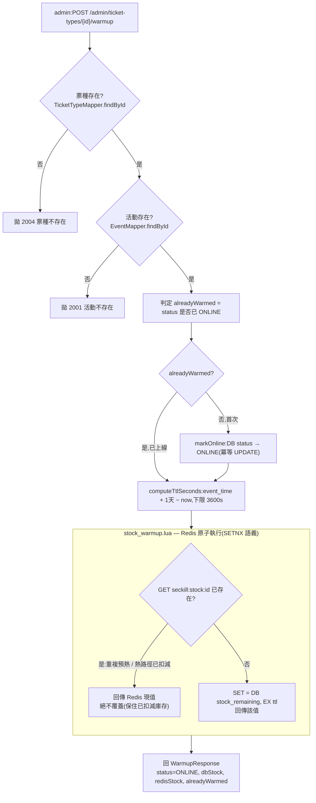
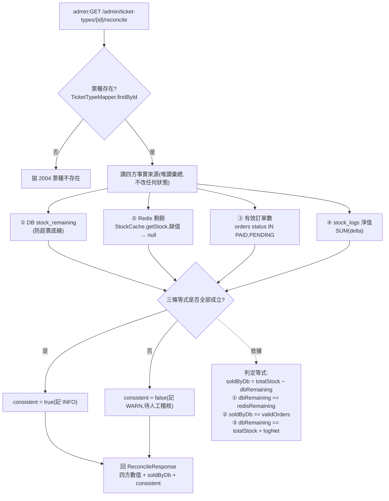

# ADR 0003:活動/票種管理、庫存預熱與對帳(M2)

日期:2026-07-11|狀態:已採納

## 背景

M2 實作活動(events)與票種(ticket_types)管理:公開查詢 API、admin CRUD、庫存預熱(warmup)、對帳(reconcile)。表已於 V1 建立。設計文件第 5、6、9、10 節定了大方向,多處實作細節需就地決策。

## 決策

### 1. 庫存預熱的冪等與「不覆蓋已扣減庫存」
- Redis key `seckill:stock:{ticketTypeId}` 的寫入以 Lua(`resources/lua/stock_warmup.lua`)原子執行:
  key 不存在才 `SET`(SETNX 語義)並設 TTL;已存在則原子回傳現值、**絕不覆蓋**。
- 這保證重複呼叫(或搶購熱路徑已扣減後再呼叫)不會把 Redis 現值蓋回初始庫存。
- 對外的 `alreadyWarmed` 旗標以「票種是否已 ONLINE」判定;warmup 一併把 DB 狀態設 ONLINE(冪等 UPDATE)。
- **取捨**:高併發下多執行緒同時對「首次」票種 warmup,可能各自讀到 OFFLINE 而都回報 `alreadyWarmed=false`;
  但 Lua 保證 Redis 只被設定一次(值恆為總量,不累加、不覆蓋),真正的安全性質不受影響。此旗標僅為人類可讀提示。

**庫存預熱流程:**



### 2. Redis 庫存 TTL
- 依設計文件第 6 節設為「活動結束 + 1 天」,以 `events.event_time + 1 天` 計。
- 若演出時間已過去導致算出非正數,clamp 至保底 3600 秒,避免寫入立即過期或負值 TTL。

### 3. 對帳的一致性判定(四方比對)
同一份「庫存事實」為效能與安全被分散存放,`reconcile`(唯讀稽核端點 `GET /admin/ticket-types/{id}/reconcile`)彙總四方並比對——① DB `stock_remaining`(防超賣底線)、② Redis 剩餘(預扣快取,**缺值即視為不一致**)、③ 有效訂單數(PAID+PENDING_PAYMENT,仍佔用庫存者)、④ `stock_logs` 淨值(SUM(delta),審計流水)。分散存放本有漂移風險(bug、部分失敗、崩潰時窗),漂移即**超賣或漏帳**,故需精確稽核偵測。判定一致的充要條件為三條等式,**各抓一類漂移以利定位**:
```
soldByDb = totalStock - dbStockRemaining
① dbStockRemaining == redisStockRemaining          # Redis↔DB 分歧(回補只補一邊 / Redis 過期未重熱)
② soldByDb == validOrderCount                       # 庫存↔訂單分歧(扣庫存沒建單 / 建單沒扣庫存)
③ dbStockRemaining == totalStock + stockLogNetDelta # 審計閉環破損(動庫存沒寫流水,或反之)
```
- **有效訂單只計 PAID + PENDING_PAYMENT**:僅這兩態仍佔庫存;EXPIRED / CANCELLED 已回補故排除。M4 超時取消一張訂單時同步:退出 validOrders(③−1)、DB `stock_remaining`+1、寫一筆 REVERT(④+1)、Redis+1,三條等式仍**同時成立**——M4 測試即以 `reconcile().consistent()` 證明回補後三方一致、不超賣不漏帳。
- **Redis 缺值視為不一致**是刻意的:reconcile 屬精確稽核,與前端讀取「即時剩餘」容忍短暫不精確定位不同(見已知限制)。
- orders / stock_logs 的寫入邏輯在 M3/M4;M2 對帳唯讀彙總這兩表,對未售出票種三方自然為 0、一致。

**庫存對帳流程:**



### 4. 公開 vs admin 的可見性邊界
- 公開列表 `GET /events` 僅回 PUBLISHED,依 `event_time` 排序;公開詳情僅 PUBLISHED 可見,未發布一律回 `2001 活動不存在`(不洩漏草稿存在性,呼應第 9 節「他人訂單回 404」的同源原則)。
- admin 端點可見所有狀態,回傳含 DB `stock_remaining` 等內部欄位的專屬 DTO。

### 5. 狀態機與編輯限制(落實在 service 層)
- 活動狀態:`DRAFT → PUBLISHED → CLOSED` 單向,同狀態為 no-op;非法轉移回 `2002`(`EventStatus.canTransitionTo`)。
- 票種僅 OFFLINE 可修改/刪除;ONLINE(已預熱)回 `2005`,避免破壞已寫入 Redis 的庫存與 DB 底線一致性。
- 活動含票種時不可刪除,回 `2003`(避免 FK 違反,並給出明確業務訊息)。
- 建立/更新票種時校驗 `seckill_start < seckill_end`,否則回 `2006`。

### 6. 新增錯誤碼 2xxx
`2001` 活動不存在、`2002` 活動狀態轉移非法、`2003` 活動含票種不可刪除、`2004` 票種不存在、`2005` 票種已上線不可改刪、`2006` 搶購時間區間非法。

### 7. 分頁參數處理
- `page`(1-based)/`size` 於 service 層 clamp(page≥1、size 1–50),不採 Bean Validation。
- **理由**:`@RequestParam` 的方法級校驗會拋 `ConstraintViolationException`,不走現有 `MethodArgumentNotValidException` 分支;clamp 較簡潔且避免對公開端點回 4xx。

### 8. ADMIN 種子方式(任務指定決策點)
- 採**環境變數驅動**的 `AdminBootstrap`(`SECKILL_ADMIN_USERNAME` / `SECKILL_ADMIN_PASSWORD`),而非提交式 Flyway seed。
- **理由**:避免把可登入的管理員憑證寫進 repo(呼應第 10 節祕密管理);啟動時若兩者皆設且帳號不存在才建立(冪等),密碼經 BCrypt 雜湊、絕不進日誌。未設定則略過,不影響 CI/測試。
- 測試取得 ADMIN 的方式:整合測試以 `UserMapper` 直接插入指定角色帳號再走登入 API 換 token(見 `AbstractAdminIntegrationTest`),不依賴任何提交式憑證。

### 9. StockCache 歸屬
- 搶購 Redis 庫存的存取封裝於 `com.seckill.event.service.StockCache`(warmup 寫入 + 讀取剩餘)。
- **取捨**:此 key 由 M3 搶購熱路徑共用;M3 實作時若需擴充扣減/回補 Lua,可評估是否上移至 `common`。M2 先置於 event 模組,避免過早抽象。

## 影響 / 附帶修正
- `SecurityConfig`:新增 `GET /api/v1/events`、`/api/v1/events/*` 匿名白名單,及 `/api/v1/admin/**` 需 `ROLE_ADMIN` 的 URL 層防護;admin controller 另加方法層 `@PreAuthorize`(雙重防護)。
- `application.yml` 新增 `seckill.admin.username/password`(環境變數,無祕密入庫)。
- **附帶修正 M1 偶發測試**:`AuthFlowIT.tamperedTokenShouldReturn401` 原本竄改 token 最後一字元,而 base64url 末字元僅含 2 個有效位元,竄改後解碼出的簽章位元組可能不變而使 token 仍有效(偶發 200)。改為竄改簽章**首字元**(必定改變第 0 個簽章位元組),使其確定性失效。

## 已知限制
- warmup 對「已 ONLINE 但 Redis key 已過期」的票種會重新以 DB `stock_remaining` 寫入 Redis;此為期望行為(過期後重新預熱),但 `alreadyWarmed` 仍回 true。
- 對帳將 Redis 缺值視為不一致;M3 上線後對「短暫不精確」的容忍屬前端讀取路徑,對帳為精確稽核,兩者定位不同。
