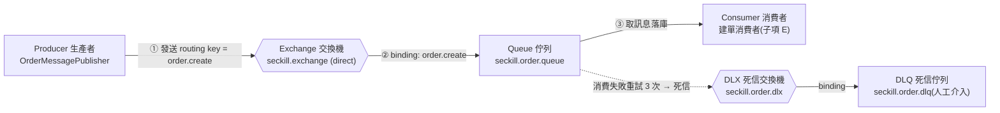
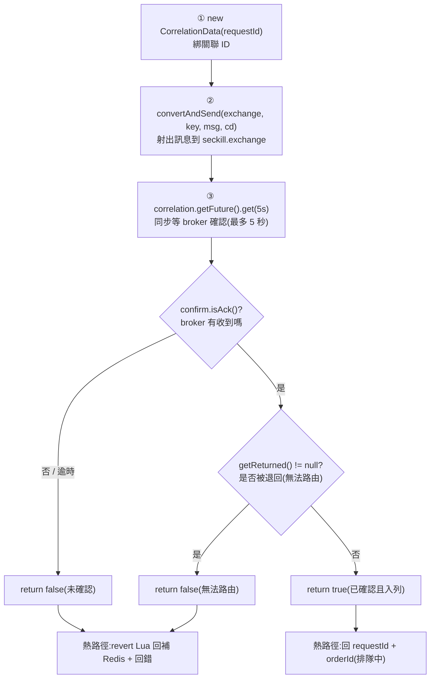
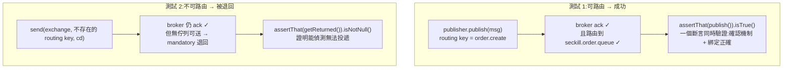

# ADR 0004:搶購核心(M3)— Lua 扣減、防刷、限流、MQ 可靠性

日期:2026-07-12|狀態:進行中(隨 M3 子項補充,完成後轉「已採納」)

## 背景

M3 實作搶購核心:一次性 token、Redis Lua 原子扣減/回補、Bucket4j 限流、RabbitMQ 生產/消費與冪等落庫。設計文件第 2、6、7、10、11 節定了大方向,多處實作細節需就地決策。本 ADR 逐子項記錄;圖以 Mermaid 呈現(GitHub 原生渲染)。

---

## 1. StockCache 擴充 vs 新元件(決策點)

- **決策**:在既有 `com.seckill.event.service.StockCache` **擴充** `deduct` / `revert`,與預熱共用同一把 `seckill:stock:{ticketTypeId}` key;已購去重集合為 `seckill:bought:{ticketTypeId}`。
- **理由**:「勿另建重複的庫存存取類」(CLAUDE.md / 任務)。單一入口封裝 stock key,避免多處拼 key、日後改前綴漏改。
- **取捨**:`StockCache` 續留 `event` 模組,產生 `seckill → event` 依賴(搶購本就需讀 `TicketType` 檢查時間窗/ONLINE,方向乾淨、非循環)。是否上移 `common` 待 M3 完整實作後再評估(見 §7 待評估項)。

## 2. deduct / revert Lua 與冪等策略

- **deduct**(`seckill_deduct.lua`):`SISMEMBER` 查重複 → `GET` 查庫存 → `DECR` 扣 → `SADD` 記已購,原子回 `1`/`-1`(重複)/`-2`(售罄)/`-3`(未預熱),忠實照設計文件第 6 節。
- **revert**(`seckill_revert.lua`):`INCR` + `SREM`,對稱回補(DB 落庫失敗、超時取消兩場景;後者屬 M4)。
- **bought 集合 TTL**:原始腳本未設 TTL,改為在**成功分支首次建立時繼承 stock key 的剩餘 TTL**(`TTL<0` 才設,只設一次、不滑動、熱路徑不讀 DB),落實第 6 節表格「bought TTL 同 stock」而不增加熱路徑成本。
- **冪等最終底線**:Redis 已購集合為第一層(快、可被清);**持久底線為 DB `uq_orders_user_ticket` 與 `uq_orders_request` 唯一約束**(落庫在子項 E)。

## 3. 一次性 token 與存取控制

- **產生**:256-bit `SecureRandom`(靜態共用實例)→ base64url;**明文只交前端**,Redis(`seckill:token:{userId}:{ticketTypeId}`,60s TTL)僅存 **SHA-256 雜湊**(防禦縱深:Redis 遭讀取也拿不到可用 token)。token 高熵,快速雜湊即足,不用 bcrypt。
- **校驗**:`seckill_token_check.lua` 先將前端明文雜湊,再 `GET` 比對後 `DEL`,原子一次性消耗,避免併發共用同一 token。
- **存取控制**:`/seckill/**` 收緊為 `ROLE_USER`(URL 層 + `@PreAuthorize` 雙防護),**防止 admin 挾權偷跑(防舞弊)**。
- **時間窗守衛**:存在(2004)→ ONLINE(3003)→ 未開賣(3001)→ 已結束(3002)。

## 4. 限流設計與取用戶端 IP 方式(決策點)

- **後端**:Bucket4j + Lettuce `ProxyManager`。Spring 的 `LettuceConnectionFactory` 不便取原生連線,故**依 `spring.data.redis.*` 另建一條專用 Lettuce 連線**供 Bucket4j(桶狀態存 Redis → 分散式限流)。取捨:多一條 Redis 連線,成本極小、換得乾淨不依賴內部實作。
- **分層(方案 B)**:
  - `/seckill/purchase`:全域 QPS(3000)→ 單 IP(10/s)→ 單用戶(2/s),`&&` 短路,任一超限回 `3004`(HTTP 429)。
  - `/seckill/token`:獨立、**以 userId 為 key** 的單用戶 5/s(`token-user-capacity`),保護該端點的 DB 查詢不被單帳號狂刷。以 userId 為 key 亦避免測試共用 localhost IP 互擾。單用戶 2/s 仍**專屬 purchase**。
  - 閾值皆 `seckill.ratelimit.*`,可經 env 覆寫。
- **取 IP(決策點)**:取 `X-Forwarded-For` **最左值**為真實 client,缺失退回 `getRemoteAddr()`。正式環境後端只經 Caddy 可達(第 10.4 節);**建議 Caddy 以 `header_up X-Forwarded-For {remote_host}` 覆寫**使其不可偽造,否則單 IP 限流對偽造 XFF 者為 best-effort(仍受全域 + 單用戶兜底)。

## 5. MQ 拓撲與生產端可靠性(confirms / mandatory)

M3 只宣告**建單**拓撲;延遲取消(`order.delay.*` / timeout,15 分鐘 TTL)屬 M4(見 §6)。消費端手動 ack / 重試 3 次進 DLQ / 冪等落庫屬**子項 E**,此處先定拓撲與生產者。

### 5.1 五角色關係與建單拓撲

生產者不直接碰佇列,只發到交換機;交換機依「路由鍵 + 綁定」決定送哪個佇列(解耦)。消費失敗重試耗盡的訊息死信到 DLX → DLQ,等人工介入。

> 五角色:① Producer 生產者　② Exchange 交換機　③ Routing key + Binding(箭頭上的規則)　④ Queue 佇列　⑤ Consumer 消費者。

### 5.2 生產者 publisher confirms 判定流程

`OrderMessagePublisher` 以 correlated confirms + `mandatory` **同步**判定:須同時 broker `ack` 且**非** unroutable(`returned`)才算成功;否則回 `false`,由搶購熱路徑回補 Redis 庫存。

**為什麼要 mandatory + returns**:publisher confirm 只保證「broker 收到訊息」,不保證「路由到佇列」。若 routing key 打錯或無綁定,交換機會默默丟棄卻仍回 `ack`。`mandatory` + `publisher-returns` 讓無法投遞的訊息被 `return`,補上這個訊息遺失的洞。

### 5.3 生產者測試驗證(`OrderMessagePublisherIT`)

## 6. M3 / M4 訂單邊界

- **M3(本里程碑)**:建單拓撲 + 建單消費者落庫(條件 UPDATE 扣 DB 庫存、寫 order + stock_logs 同事務、冪等)+ `seckill:result:{requestId}` 供輪詢。
- **M4**:延遲取消拓撲(`order.delay.exchange` / `order.timeout.queue`)、超時自動取消回補、模擬支付、狀態機、兜底排程。M3 建單成功**不**發延遲訊息(屬 M4 生命週期)。

---

## 7. 待補 / 待評估(M3 完成時收斂)

- **子項 E**:消費端手動 ack、消費併發 4、重試 3 次進 DLQ、`orders` 唯一約束冪等、DB 條件 UPDATE 扣庫存與 revert。
- **子項 F**:`/seckill/purchase` 串接(限流 → token → deduct → 發 MQ → revert 補償)、`/seckill/result` 輪詢、3xxx 錯誤碼補齊、限流 429 端到端測試。
- **子項 G**:Micrometer 全套埋點(`seckill_requests_total` 各 result、`seckill_order_create_duration_seconds`、`seckill_redis_stock` gauge、`seckill_stock_revert_total`)、覆蓋率 ≥ 80% 驗收、限制與 review 重點總結。
- **待評估**:`StockCache` 是否上移 `common`(§1);`publish()` 5 秒 confirm 逾時值依壓測調整。
