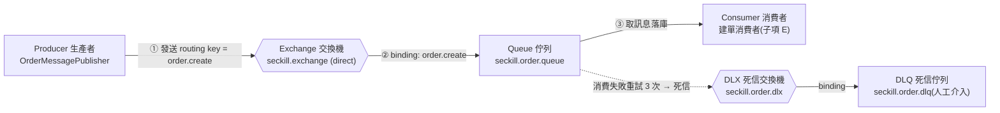
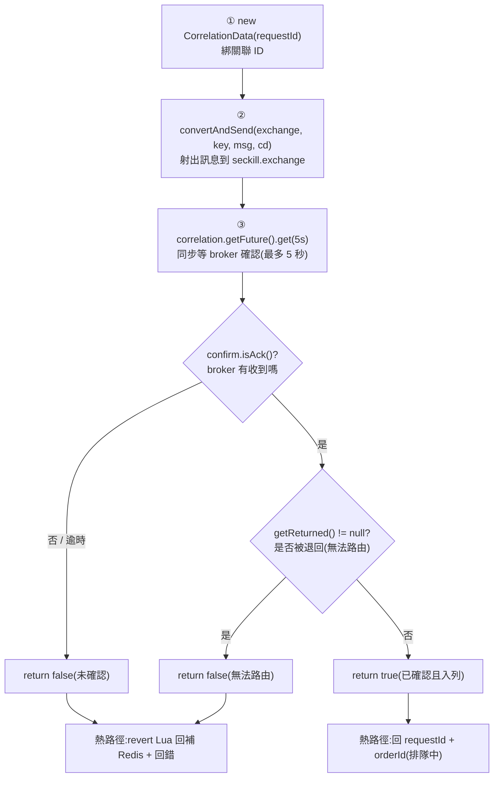
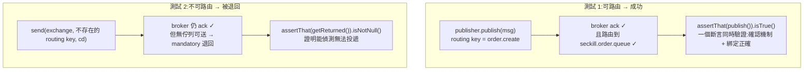

# ADR 0004:搶購核心(M3)— Lua 扣減、防刷、限流、MQ 可靠性

日期:2026-07-12|狀態:已採納(M3 完成)

## 背景

M3 實作搶購核心:一次性 token、Redis Lua 原子扣減/回補、Bucket4j 限流、RabbitMQ 生產/消費與冪等落庫。設計文件第 2、6、7、10、11 節定了大方向,多處實作細節需就地決策。本 ADR 逐子項記錄;圖以 Mermaid 呈現(GitHub 原生渲染)。

---

## 1. StockCache 擴充 vs 新元件(決策點)

- **決策**:在既有 `com.seckill.event.service.StockCache` **擴充** `deduct` / `revert`,與預熱共用同一把 `seckill:stock:{ticketTypeId}` key;已購去重集合為 `seckill:bought:{ticketTypeId}`。
- **理由**:「勿另建重複的庫存存取類」(CLAUDE.md / 任務)。單一入口封裝 stock key,避免多處拼 key、日後改前綴漏改。
- **取捨**:`StockCache` 續留 `event` 模組,產生 `seckill → event` 依賴(搶購本就需讀 `TicketType` 檢查時間窗/ONLINE,方向乾淨、非循環)。是否上移 `common` 待 M3 完整實作後再評估(見 §7 待評估項)。

## 2. deduct / revert Lua 與冪等策略

- **deduct**(`seckill_deduct.lua`):`SISMEMBER` 查重複 → `GET` 查庫存 → `DECR` 扣 → `SADD` 記已購,原子回 `1`/`-1`(重複)/`-2`(售罄)/`-3`(未預熱),忠實照設計文件第 6 節。
- **revert**(`seckill_revert.lua`):`INCR` + `SREM`,對稱回補(DB 落庫失敗、超時取消兩場景;後者屬 M4)。
- **bought 集合 TTL**:原始腳本未設 TTL,改為在**成功分支首次建立時繼承 stock key 的剩餘 TTL**(`TTL<0` 才設,只設一次、不滑動、熱路徑不讀 DB),落實第 6 節表格「bought TTL 同 stock」而不增加熱路徑成本。
- **冪等最終底線**:Redis 已購集合為第一層(快、可被清);**持久底線為 DB `uq_orders_user_ticket` 與 `uq_orders_request` 唯一約束**(落庫在子項 E)。

## 3. 一次性 token 與存取控制

- **產生**:256-bit `SecureRandom`(靜態共用實例)→ base64url;**明文只交前端**,Redis(`seckill:token:{userId}:{ticketTypeId}`,60s TTL)僅存 **SHA-256 雜湊**(防禦縱深:Redis 遭讀取也拿不到可用 token)。token 高熵,快速雜湊即足,不用 bcrypt。
- **校驗**:`seckill_token_check.lua` 先將前端明文雜湊,再 `GET` 比對後 `DEL`,原子一次性消耗,避免併發共用同一 token。
- **存取控制**:`/seckill/**` 收緊為 `ROLE_USER`(URL 層 + `@PreAuthorize` 雙防護),**防止 admin 挾權偷跑(防舞弊)**。
- **時間窗守衛**:存在(2004)→ ONLINE(3003)→ 未開賣(3001)→ 已結束(3002)。

## 4. 限流設計與取用戶端 IP 方式(決策點)

- **後端**:Bucket4j + Lettuce `ProxyManager`。Spring 的 `LettuceConnectionFactory` 不便取原生連線,故**依 `spring.data.redis.*` 另建一條專用 Lettuce 連線**供 Bucket4j(桶狀態存 Redis → 分散式限流)。取捨:多一條 Redis 連線,成本極小、換得乾淨不依賴內部實作。
- **分層(方案 B)**:
  - `/seckill/purchase`:全域 QPS(3000)→ 單 IP(10/s)→ 單用戶(2/s),`&&` 短路,任一超限回 `3004`(HTTP 429)。
  - `/seckill/token`:獨立、**以 userId 為 key** 的單用戶 5/s(`token-user-capacity`),保護該端點的 DB 查詢不被單帳號狂刷。以 userId 為 key 亦避免測試共用 localhost IP 互擾。單用戶 2/s 仍**專屬 purchase**。
  - 閾值皆 `seckill.ratelimit.*`,可經 env 覆寫。
- **取 IP(決策點)**:取 `X-Forwarded-For` **最左值**為真實 client,缺失退回 `getRemoteAddr()`。正式環境後端只經 Caddy 可達(第 10.4 節);**建議 Caddy 以 `header_up X-Forwarded-For {remote_host}` 覆寫**使其不可偽造,否則單 IP 限流對偽造 XFF 者為 best-effort(仍受全域 + 單用戶兜底)。

## 5. MQ 拓撲與生產端可靠性(confirms / mandatory)

M3 只宣告**建單**拓撲;延遲取消(`order.delay.*` / timeout,15 分鐘 TTL)屬 M4(見 §6)。

### 5.1 五角色關係與建單拓撲

生產者不直接碰佇列,只發到交換機;交換機依「路由鍵 + 綁定」決定送哪個佇列(解耦)。消費失敗重試耗盡的訊息死信到 DLX → DLQ,等人工介入。

> 五角色:① Producer 生產者　② Exchange 交換機　③ Routing key + Binding(箭頭上的規則)　④ Queue 佇列　⑤ Consumer 消費者。

### 5.2 生產者 publisher confirms 判定流程

`OrderMessagePublisher` 以 correlated confirms + `mandatory` **同步**判定:須同時 broker `ack` 且**非** unroutable(`returned`)才算成功;否則回 `false`,由搶購熱路徑回補 Redis 庫存。

**為什麼要 mandatory + returns**:publisher confirm 只保證「broker 收到訊息」,不保證「路由到佇列」。若 routing key 打錯或無綁定,交換機會默默丟棄卻仍回 `ack`。`mandatory` + `publisher-returns` 讓無法投遞的訊息被 `return`,補上這個訊息遺失的洞。

### 5.3 生產者測試驗證(`OrderMessagePublisherIT`)

## 6. M3 / M4 訂單邊界

- **M3(本里程碑)**:建單拓撲 + 建單消費者落庫(條件 UPDATE 扣 DB 庫存、寫 order + stock_logs 同事務、冪等)+ `seckill:result:{requestId}` 供輪詢。
- **M4**:延遲取消拓撲(`order.delay.exchange` / `order.timeout.queue`)、超時自動取消回補、模擬支付、狀態機、兜底排程。M3 建單成功**不**發延遲訊息(屬 M4 生命週期)。

---

## 7. 建單消費者與冪等落庫(子項 E)

- **手動 ack、消費併發 4**(application.yml `listener.simple`)。業務成功才 ack,at-least-once。
- **落庫順序:先建訂單、再扣 DB 庫存**(同一 `@Transactional`):重複訊息在建單即撞 `uq_orders_request`,於扣庫存前中止,不誤觸「售罄補償」;DB 售罄(影響行數 0)拋 `DbStockDepletedException` 整筆回滾。
- **四條消費路徑**:成功 → `SUCCESS:orderId` + ack;唯一鍵衝突 → 冪等視為已處理 + ack;DB 售罄 → 回補 Redis + `FAIL` + ack(不重試);未預期例外 → 依 `x-retry-count` header **republish 遞增計數重試 3 次** → `basicNack(requeue=false)` 死信至 DLQ。
- **重試以 header 計數 + republish**(非 `requeue=true`),使計數可累加;建單佇列採即時重試(無延遲,延遲屬 M4)。
- **反序列化安全**:`Jackson2JsonMessageConverter` 設 `setTrustedPackages("com.seckill.order.mq")`,避免以 `__TypeId__` 反序列化任意類別。
- **result 快取歸屬**:`OrderResultCache`(`seckill:result:{requestId}`,10 分鐘 TTL)置於 order 模組(由消費者寫入),供 seckill 輪詢端點讀取,避免 seckill↔order 循環依賴。

## 8. 搶購下單串接與輪詢(子項 F)

- **`POST /seckill/purchase`**:token 消耗(Lua)→ deduct(Lua)→ 產 orderId+requestId → 發 MQ;**全程 Redis+MQ,絕不觸 DB**。發送未確認 → revert 回補 + `3009` + 記 `stock_revert`。
- **檢查順序**:token 在 deduct 前消耗(用後即焚);售罄/重複時 token 已用掉需重領——那些情況本就無法成交,可接受。
- **3xxx 對應與指標**:`3005` 售罄 / `3006` 重複 / `3007` 無效 token / `3008` 未就緒 / `3009` 入列失敗,各累加 `seckill_requests_total` 對應 result 標籤。
- **`GET /seckill/result/{requestId}`**:QUEUING(無 key)/ SUCCESS(orderId)/ FAIL(原因)。未加擁有權校驗(requestId 為不可猜 UUID、只回本人)。

## 9. 監控埋點(子項 G)

- **`SeckillMetrics` 置於 `common`**,供 seckill(熱路徑)與 order(消費者)共用,避免模組循環依賴。
- **Meter 採 Micrometer dot 命名**,由 Prometheus registry 轉為設計指定匯出名;實測 `scrape()` 確認**無 `_total`/`_seconds` 雙後綴**(新版 prometheus-metrics client 會正確去重,含 M1 既有的 `id_generator_clock_backwards_total`)。
- **gauge**:`StockGaugePublisher` `@Scheduled` 每 5s 讀 ONLINE 票種 Redis 庫存,更新 `seckill_redis_stock{ticket_type_id}`;各票種 gauge 僅註冊一次。
- **`id_generator_clock_backwards_total`** M1 已接(`SnowflakeIdGenerator`),本里程碑僅確認匯出正確。
- 測試以 `@AutoConfigureObservability` 啟用 Prometheus registry(@SpringBootTest 預設關閉 export 以加速,正式環境不受影響)。

## 10. 驗收與已知限制

**驗收**:`./mvnw verify` 綠(27 單元 + 64 整合);零超賣(庫存 10 / 50 執行緒 → 恰 10 筆訂單,DB=Redis=有效訂單數三方一致);seckill 95.1% / order 89.1% 行覆蓋率(≥ 80%)。

**已知限制**:
- **DLQ 路徑不寫 result key**:訊息進 DLQ 後 `seckill:result:{requestId}` 仍為 QUEUING,前端會輪詢逾時。屬需人工介入的異常,留待維運 / M4 處理。
- **`bought` 集合 TTL** 繼承 stock key 剩餘 TTL;若 stock key 無 TTL(僅測試 / 誤設)則 bought 亦無,DB 唯一約束為持久去重底線。
- **單 IP 限流對偽造 XFF 為 best-effort**,需正式環境 Caddy 覆寫 XFF(§4)。
- **全域限流桶為單一 Redis key**,多實例共享同一上限(符合設計「全域 QPS」語意);跨測試 context 共用此 key 需在併發測試前重置。
- **`publish()` confirm 逾時 5 秒**、限流閾值、消費併發 4 皆待壓測(M7)調整。

**建議 review 重點**:落庫先建單再扣庫存的順序取捨(§7)、四條消費路徑與冪等、取 IP 與 XFF 信任模型(§4)、`StockCache` 是否上移 `common`(§1,建議 M4 再評估)。
