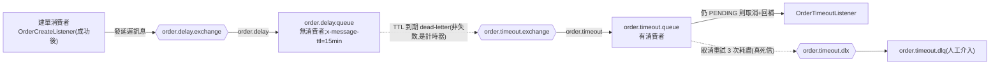
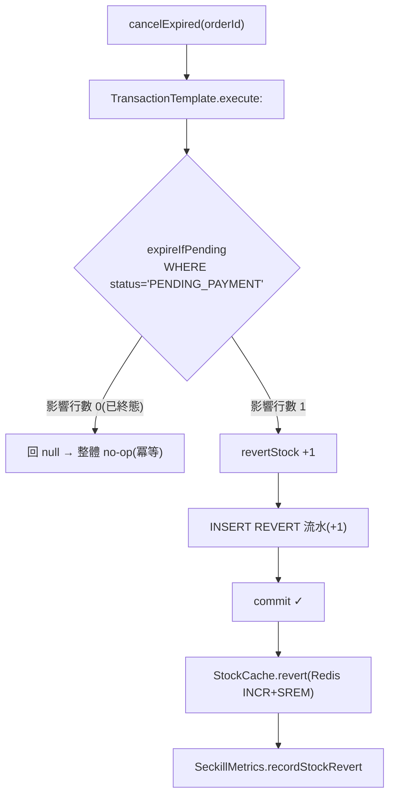

# ADR 0005:訂單生命週期(M4)— 延遲取消、支付狀態機、雙保險回補

日期:2026-07-12|狀態:已採納(M4 完成)

## 背景

M4 實作訂單生命週期:建單後 15 分鐘支付窗、模擬支付、逾時自動取消並回補庫存。設計文件第 2、5、7、9、11 節定了大方向(延遲佇列 TTL+DLX、狀態機條件 UPDATE、庫存三方對帳、`stock_revert` 指標),多處實作細節就地決策,本 ADR 逐項記錄。延續 M3(ADR 0004)的建單拓撲與共用元件(`StockCache`、`OrderCreateService`、`OrderMessagePublisher`、`SeckillMetrics`)。

---

## 1. 延遲取消拓撲(TTL + DLX 機制)

- **決策**:新增兩組交換機/佇列(擴充 `RabbitConfig`):
  - `order.delay.exchange` → `order.delay.queue`:**無消費者**,`x-message-ttl`(預設 15 分鐘);dead-letter 至 `order.timeout.exchange`。
  - `order.timeout.exchange` → `order.timeout.queue`:**有消費者**(`OrderTimeoutListener`);自身再掛真死信 `order.timeout.dlx` → `order.timeout.dlq`。
- **理由**:利用 RabbitMQ「per-queue TTL 到期即 dead-letter」的特性做延遲投遞——延遲佇列純滯留計時,到期後訊息被路由到超時佇列由消費者處理。忠實照設計文件第 7 節。
- **取捨**:此處的 dead-letter **不是**失敗處理,而是「延遲投遞」的手段(TTL 到期是正常快樂路徑);與建單 DLQ、超時 DLQ 兩個「真死信」語意不同,三者只是都用到 RabbitMQ 的 dead-letter 機制。

## 2. 延遲 TTL 的可測試性:queue TTL vs per-message expiration(決策點)

- **決策**:`order.delay.queue` 的 `x-message-ttl` 由 `order.delay.ttl-ms` 決定(預設 900000),**所有執行環境一致**;測試提速**不**覆寫佇列 TTL,改以逐訊息 `expiration`(測試端直接發短延遲訊息,RabbitMQ 取 queue 與 per-message TTL 的**最小值**)。
- **理由**:M4 讓建單消費者在成功後發延遲訊息,而本專案多個 cached test context 共用同一組 Testcontainers 與 durable 佇列。若「各測試用 `@TestPropertySource` 覆寫佇列 TTL」(直覺做法)會踩兩個雷:
  1. 同名 durable 佇列以不同 `x-message-ttl` 重複宣告 → RabbitMQ `PRECONDITION_FAILED`(且哪個 context 先啟動不確定);
  2. 不同 context 的建單消費者競爭消費、以不同 TTL 發延遲訊息 → head-of-line 阻塞與非確定性。
  固定佇列 TTL(所有 context 一致宣告)+ 測試端逐訊息 `expiration` 兩者都避開,且正式環境仍可經 env 調整佇列 TTL。
- **取捨**:逐訊息 `expiration` 屬測試手段而非產線路徑(產線 `OrderDelayPublisher` 不設 per-message expiration,依佇列 TTL);測試因此不經 `OrderDelayPublisher` 驗證「延遲計時」時序,而由「建單成功發一則延遲訊息」另一測試(佇列 900000ms、訊息滯留可觀測)覆蓋 publisher 正確性,兩者聯集達成完整覆蓋。

## 3. 超時消費者 vs 兜底排程:雙保險(belt-and-suspenders)

- **決策**:超時取消由**兩套**機制冗餘保障:
  - 主:延遲佇列(事件驅動、即時)→ `OrderTimeoutListener`。
  - 備:`OrderExpiryScheduler`(`@Scheduled` 輪詢,預設每 60s)掃 `status='PENDING_PAYMENT' AND expire_at < now`(走部分索引 `idx_orders_status_expire`)。
- **理由**:延遲訊息非 100% 可靠(發送失敗、broker 重啟、佇列清空、超時消費進 DLQ)。一旦漏接,訂單永久卡 `PENDING_PAYMENT`、庫存無法回補、少賣一張。兜底排程以 DB 事實為準,把漏接者接住。
- **取捨**:輪詢有延遲/成本取捨——太頻繁浪費 DB、太稀疏回補慢;故主機制負責即時,兜底負責「一定接住」,間隔 60s 折衷。兩套共用同一冪等 `cancelExpired`,疊加只補齊、不多做。

## 4. 共用取消回補 service:DB 事務與 Redis 順序、失敗處理(決策點)

- **決策**:取消邏輯抽成 `OrderCancelService.cancelExpired(orderId)`,超時消費者與兜底排程共用。**單一事務內**:條件 UPDATE 訂單 EXPIRED → 回補 DB 庫存(`revertStock`)→ 寫 REVERT 流水(三者原子);**事務 commit 之後**才回補 Redis 庫存 + 記 `stock_revert` 指標。
- **理由**:DB 是最終事實來源。先 commit DB 再動 Redis,避免「Redis 已回補但 DB 事務回滾」的**多補**(超賣風險)。反向殘留(DB 已取消、Redis 未補)只是暫時偏少,可被兜底排程/對帳觀測,且延遲訊息重投為冪等(條件 UPDATE 影響行數 0 → no-op)不會二次回補。
- **取捨**:以 `TransactionTemplate` 顯式界定事務邊界,而非同類 `@Transactional` 方法自呼叫——後者會被 Spring 代理繞過而失效(自呼叫走原始物件,不經攔截器),且無明確 commit 點可讓 Redis 回補確定發生在 commit 之後。若 DB commit 後、Redis 回補前程序崩潰:DB 已 EXPIRED 但 Redis 少補一格,由兜底排程無法再取消(已非 PENDING)——此殘留由對帳 API 偵測、屬已知限制(見 §10),Phase 2 可加補償。

## 5. EXPIRED vs CANCELLED 語意(決策點)

- **決策**:超時系統自動取消一律轉 **`EXPIRED`**;`CANCELLED` 語意保留給未來「使用者主動取消」。M4 只有超時取消,故僅使用 EXPIRED。
- **理由**:兩者在對帳與客服語意不同——EXPIRED 是「逾時未付款系統回收」,CANCELLED 是「使用者/客服主動退」。分開存於同一 `status` 欄,利於後續報表與 Phase 2 退款流程。
- **取捨**:目前 `CANCELLED` 為未使用的保留值;`reconcile` 的有效訂單數只計 `PAID + PENDING_PAYMENT`,EXPIRED/CANCELLED 皆排除,語意一致。

## 6. 支付/取消狀態機與併發互斥

- **決策**:模擬支付 `POST /orders/{id}/pay` 走純條件 UPDATE `SET status='PAID', paid_at=now WHERE id=? AND user_id=? AND status='PENDING_PAYMENT'`;影響行數 0 時由 service 區分:不存在 / 非本人 → `4001`(404);本人但非 PENDING → `4002`(409)。
- **理由**:狀態轉移落實於 SQL 層(CLAUDE.md)。支付與超時取消對同一 PENDING 訂單的競態,靠兩者皆 `WHERE status='PENDING_PAYMENT'` 的條件 UPDATE + 行鎖**天然互斥**:恰一方影響行數 1。已多執行緒測試(pay×5 vs cancel×5)驗證恰一方成功——pay 勝出則 PAID、不回補;cancel 勝出則 EXPIRED、回補恰一次、pay 端回 4002。
- **取捨**:支付無需 `@Transactional`(單一原子 UPDATE + 一次讀回);他人訂單一律回 **404 而非 403**,不洩漏訂單存在性(設計文件第 9 節)。

## 7. 我的訂單查詢與歸屬

- **決策**:`GET /orders`(分頁,`created_at DESC, id DESC`,走 `idx_orders_user`)、`GET /orders/{id}`(校驗歸屬,他人回 404)。回應 DTO(`OrderResponse`)ID 一律轉 String;分頁沿用 `event.dto.PageResponse`。
- **理由**:`id`(Snowflake 趨勢遞增)為同秒建立的穩定 tiebreaker,避免分頁跨頁時序不穩。ID 轉 String 防前端 JS number 精度丟失(全專案慣例)。
- **取捨**:order 模組本就依賴 event,復用其 `PageResponse` 而不新造;此通用分頁型別未來可上移 `common`,留待後續統一重構(不在本里程碑動 event 模組)。

## 8. 錯誤碼 4xxx

- 新增 `ORDER_NOT_FOUND(4001, 404)`、`ORDER_STATUS_INVALID(4002, 409)`,由 `GlobalExceptionHandler` 轉統一格式,controller 不 try-catch。

## 9. 訊息格式與型別安全

- **決策**:延遲訊息 `OrderDelayMessage(orderId, ticketTypeId, userId)` 置於 `com.seckill.order.mq`(落在 `RabbitConfig` 既有 `trustedPackages`,無需擴白名單)。
- **理由**:取消以 `orderId` 為權威鍵(消費者對訂單做條件 UPDATE);`ticketTypeId`/`userId` 供結構化日誌觀測,回補所需值由 service 依訂單重新載入(單一事實來源)。
- **取捨**:訊息帶了觀測用的冗餘欄位;換得除錯可讀性,且對齊設計文件第 7 節的訊息格式。

---

## 10. 驗收與已知限制

**驗收**:`./mvnw verify` 綠(81 整合測試 + 單元測試全過);超時訂單自動取消且**庫存三方對帳一致**(reconcile:DB=Redis=有效訂單數,回補後售出數−1);支付/取消併發恰一方成功、不重複回補、不超賣;order 模組行覆蓋率 **86.4%**(≥ 80%)。

**已知限制**:
- **DB commit 後、Redis 回補前崩潰**:訂單已 EXPIRED 但 Redis 少補一格;兜底排程無法再取消(已非 PENDING),殘留需靠對帳 API 偵測。屬極小機率的程序崩潰時窗,Phase 2 可加「對帳觸發的補償回補」。
- **`OrderTimeoutListener` 重試/DLQ 路徑、`OrderExpiryScheduler` 的 `@Scheduled` wrapper 未被測試覆蓋**(整體仍 86.4% ≥ 80%):重試/DLQ 邏輯與建單消費者對稱(後者已測);兜底以 `sweepOnce()` 直呼驗證,`@Scheduled` wrapper 僅一行委派。
- **延遲訊息為 best-effort**(不做同步 confirm):訂單已落庫,偶失由兜底排程兜底;發送例外只記日誌。
- **兜底排程掃描為單批 `batch-limit`(預設 500)**:大量積壓時分多次排程續掃,極端積壓下回補延遲取決於間隔×批次;閾值待壓測(M7)調整。
- **測試期間兜底排程自動觸發被關閉**(共用基底把 initial-delay/interval 拉遠),改由 IT 直呼 `sweepOnce()`,避免自動掃描非同步取消其他測試殘留訂單造成 flakiness。

**建議 review 重點**:
- 取消回補的 **DB 事務與 Redis 順序**及崩潰時窗取捨(§4)。
- **雙保險**下超時消費者與兜底排程的冪等疊加(§3、§4)。
- **支付/取消併發互斥**與 404 不洩漏存在性(§6)。
- **延遲 TTL 可測試性**方案:固定佇列 TTL + 逐訊息 expiration(§2)。
- **EXPIRED vs CANCELLED** 語意與 `reconcile` 有效訂單定義的一致性(§5)。
