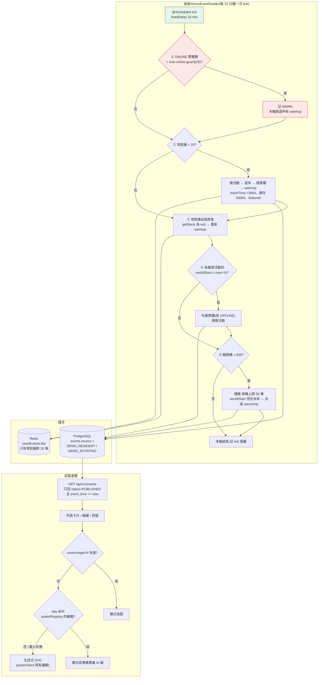

# 自動化 Demo 活動產生器(Demo Event Seeder)實作計畫

> 狀態:**待 review,尚未動工**。日期:2026-08-17。
> 提出背景:PROD 首頁的活動全靠人工建立,不主動建就顯得冷清。本專案是展示性大於實用性的
> side project,因此需要一個常駐機制,讓 https://tixco.kozow.com 首頁隨時有一定數量的活動。
> 排程順序上的建議:**本計畫整批完成並部署穩定至少一天後,才開 HANDOFF.md 的壓測階段 1**,
> 理由見本文第 11 節。

---

## 1. 目標與非目標

**目標**

- PROD 首頁(`/events` 列表 + 首頁輪播)隨時維持約 **820 筆**活動(約 82 頁),內容會隨時間輪替。
- 隨時保有 20 個「真的可以完整走完搶購流程」的活動,供 demo 使用。
- 不需要任何人工介入,不需要圖片素材。
- 對既有系統的量測前提(尤其 Redis 負載與 Prometheus 序列數)**不造成隨時間成長的干擾**。
- **產出的文案要有足夠的詞彙多樣性**,作為日後 Elasticsearch 研究的檢索語料(見第 5 節)。

**非目標**

- 不模擬真實使用者搶購流量(那是 k6 壓測的事)。
- 不追求資料的商業真實性(價格、場次、座位圖都只是門面)。
- 不在 dev 環境預設啟用(dev 已有測試殘留資料,再加 seeder 只會更亂)。

### 1.1 完成後的樣子(完整流程)

本計畫做完之後,**整條鏈路沒有任何人工介入點**——部署完就自己跑。



**穩態下的實際樣貌**:池子填滿後,多數 tick 只做幾個 count 查詢就結束(建立數 0);
平均每天約 16 筆汰換。首頁恆有約 820 筆活動、輪播 6 格、20 個隨時可完整走完搶購流程的入口。
ONLINE 票種數恆為 20,對 Redis 與 Prometheus 的負載**不隨時間成長**。

---

## 2. 關鍵限制(已從程式碼確認,不是推測)

這三點決定了整個設計形狀,實作前務必理解,否則會做出一個**永遠清不掉、而且會持續污染壓測數據**的東西。

| # | 限制 | 出處 |
|---|---|---|
| 1 | 票種一旦 `warmup` 就變 ONLINE,**之後既不能改也不能刪**(回 2005);而 `TicketTypeMapper` 只有 `markOnline`,**沒有 markOffline**,admin API 也沒有下線端點 | `TicketTypeService.requireOffline()`、`TicketTypeMapper` |
| 2 | 活動底下只要還有票種就**不能刪**(`EVENT_DELETE_FORBIDDEN`)。與第 1 點連鎖:warmup 過的活動在 PROD 上等於永久資料,只能進 DB 手動 DELETE | `EventService.delete()` |
| 3 | `StockGaugePublisher` 每 5 秒把**所有 ONLINE 票種**撈出來逐一(非 pipeline)對 Redis 做 GET,並為每個票種註冊一條 `seckill_redis_stock{ticket_type_id=…}`,gauge map **永不移除** | `StockGaugePublisher.syncStockGauges()` |

另外兩點會影響前台觀感:

- **未預熱票種的購買按鈕是「可按但必失敗」**:`EventDetailView.vue` 的 disabled 條件是
  `phase !== 'live' || remaining === 0`,而未預熱時 `remaining` 是 `null`(不是 0),按鈕仍啟用。
  → **任何處於 live 相位的票種都必須已 warmup**,否則 demo 反效果。
- **首頁列表卡片看不到票種資訊**:`EventSummaryResponse` 只有 title / venue / coverImageUrl /
  eventTime / status。所以首頁的「熱鬧感」來自**活動筆數 + 標題多樣性(海報由 title 種子生成)+
  演出時間分佈**,與票種相位無關。

---

## 3. 池子設計

核心想法:**把「會 warmup 的」與「會輪替的」徹底分開,兩者互不重疊。**

| 桶 | 目標數量 | 是否 warmup | 生命週期 | 用途 |
|---|---|---|---|---|
| **常駐桶** `DEMO_RESIDENT` | 固定 **20** | ✅ 是 | 建立後**永不刪除**;每個活動固定 **1 個**票種,`seckillEnd = 建立時 +365 天`、`eventTime = +366 天`、庫存 50000 | 首頁輪播(`featured=true`,order 100–119,讓人工精選永遠排前面);隨時可完整 demo 搶購 |
| **輪替桶** `DEMO_ROTATING` | 維持 **800** | ❌ 否 | 票種 `seckillStart` 快到期(進入 live 前 1 小時)時,**整個活動連票種一起刪掉**,再補新的 | 首頁列表的厚度與新鮮感(約 80 頁) |
| (規劃中)**靜態桶** `DEMO_ARCHIVE` | 10 萬 ~ 100 萬 | ❌ 否 | 一次性批次灌入,**seeder 完全不管理** | Elasticsearch 研究語料,**不在本計畫範圍**,見第 5 節 |

常駐桶每個活動固定 1 個票種,是為了讓 **ONLINE 票種數恆等於常駐活動數(20)**,上限一眼可算。

**輪替桶的資料形狀**

- `eventTime`:隨機分佈於 now + 7 天 ~ now + 180 天(讓首頁 `ORDER BY event_time ASC` 有層次)。
- 票種 `seckillStart`:取 `eventTime - 3~30 天`,但**至少為 now + 2 天**(取 max,否則近期活動會算出
  過去的開賣時間,一建立就進入 live 相位 → 未預熱卻可按的按鈕);`seckillEnd = seckillStart + 7 天`。
- 每個活動配 1~3 個票種(搖滾區 / A 區 / B 區),價格與庫存隨機但固定範圍。
- `coverImageUrl` 一律留 `null` → 前端依第 6 節的三層 fallback 決定顯示樂團專屬 AI 圖或生成式 SVG,
  **seeder 完全不需要知道圖片的存在**。

**每次 tick(預設 10 分鐘)做的事,依序:**

1. **上限硬防護**:查目前 demo 來源的 ONLINE 票種數,若 `> max-online-guard`(預設 25),
   記 `WARN` 並**跳過所有 warmup 動作**,其餘照做。這是防止未來改壞造成無限成長的保險絲。
2. **補常駐桶**:若 `DEMO_RESIDENT` 活動數 < 20,建立缺的(create → publish → 建票種 → warmup)。
   正常情況只有第一次 tick 會做事。
3. **常駐桶自我修復**:對每個常駐票種呼叫 `stockCache.getStock(id)`,若為 `null`
   (Redis key 過期或 Redis 曾被清空),重新呼叫 `warmup`(冪等、條件寫入,不會蓋掉現值)。
4. **輪替桶淘汰**:找出 `DEMO_ROTATING` 且票種 `seckillStart <= now + 1 小時` 的活動,
   先刪票種(全為 OFFLINE,現有 API 就能刪)再刪活動。
5. **輪替桶補齊**:補到 800 筆,但**每次 tick 最多建立 50 筆**(節流,避免程式出錯時瞬間爆量)。

**填充與汰換速率**(決定 `max-creations-per-tick` 該設多少):

- 首次啟動要從 0 填到 800:`800 ÷ 50 = 16` 個 tick ≈ **2.7 小時**。
- 穩態下的汰換量:輪替活動的平均壽命約 40~60 天(`seckillStart` 分佈決定),
  `800 ÷ 50 天 ≈ 每天 16 筆` → 平均每 9 個 tick 才需要建 1 筆,節流上限完全用不到。

---

## 4. 為什麼這個形狀能避開第 2 節的三個限制

這一段是整份計畫的重點,review 時請優先看這裡。

- **限制 1、2(warmup 後不可刪)** → 只有常駐桶會 warmup,而常駐桶**本來就不打算刪**,
  所以「不可刪」不再是問題。輪替桶從頭到尾沒有 warmup 過、票種恆為 OFFLINE,
  用**現有 API 就能完整刪除**,不需要新增 `markOffline`、不需要動任何核心領域規則。
- **限制 3(gauge 只增不減)** → gauge 只在票種出現在 `findOnlineIds()` 時註冊,而輪替桶
  從未 ONLINE,所以**永遠不會產生 gauge**。ONLINE 票種數恆為 20(常駐桶),
  `StockGaugePublisher` 每 5 秒固定 20 次 Redis GET(估算約 4 ms),**不隨時間成長**,
  Prometheus 的 `seckill_redis_stock` 序列數也固定在 20 條。
  即使輪替桶擴到 800、日後靜態桶擴到百萬,這個數字**都不會變**——這正是三桶分離的目的。
- **「可按但必失敗」的按鈕** → 輪替桶的 `seckillStart` 恆在未來(進入 live 前 1 小時就被淘汰),
  永遠停在 upcoming 相位,按鈕永遠 disabled;真正 live 的只有已 warmup 的常駐桶。

**副作用(正面)**:第 3 步的自我修復順手補上一個既有運維缺口——PROD Redis 若重啟且無持久化,
warmup 過的庫存會消失、需要人工重打 warmup API。seeder 會自動修復**常駐桶**的庫存
(但**不涵蓋手動建立的活動**,那仍需人工處理)。

---

## 5. 為 Elasticsearch 研究預留的設計

本計畫**不實作 Elasticsearch**,但 seeder 產出的資料就是日後 ES 研究的語料,現在的內容設計決定了
到時候能不能做出有說服力的 demo,所以在此定調。

### 5.1 定調:走功能面,不走效能面

**已決定(2026-08-17,使用者決策):ES 研究的主軸是功能面(文字檢索品質),不是效能面。**

理由必須寫清楚,因為「資料量愈大愈能證明 ES 價值」是個很自然但站不住腳的推論:目前的搜尋是
`title ILIKE ('%' || #{keyword} || '%')`,前置萬用字元讓 B-tree 用不上,所以確實是全表掃描。
但 Postgres 對這件事有現成解——`pg_trgm` 擴充 + 一個 GIN 索引,兩行 SQL 就讓 `%關鍵字%`
變成索引查詢,百萬筆也是毫秒級。**如果 demo 的論證是「ILIKE 慢、ES 快」,一句「那你為什麼不加
pg_trgm」就打穿了**,而且答案會變成「因為我想用 ES」——為用而用。

ES 真正贏過 Postgres 的地方幾乎都與資料量無關(中文分詞、相關性排序、多欄位加權、錯字容忍、
facet 聚合、autocomplete、同義詞),這些在一萬筆資料上就能完整展示。**因此瓶頸不是筆數,
是文案的詞彙多樣性**——100 萬筆「XX 巡迴演唱會 2026」同一個模板,ES 也搜不出東西,
facet 只會有三個桶。

### 5.2 對 `DemoContentPool` 的要求(這是本計畫最需要用心的部分)

不是「模板填空」,而是要能產生**彼此差異度高**的文案。具體要求:

| 要求 | 為什麼 | 驗收方式 |
|---|---|---|
| **多維度組合**:藝人/團名 × 曲風 × 巡演主題 × 城市 × 場館 × 年份 × 場次類型(首唱會/安可場/音樂節) | 讓 facet 聚合有均勻分佈的維度可切 | 每個維度至少 15 個值,任兩維度可自由組合 |
| **每個活動有專屬的獨立詞彙**(團名、專輯名、曲目名) | 驗證精確匹配與 BM25 相關性排序——若所有文案共用詞彙,相關性分數會全部一樣 | 隨機抽 100 筆,每筆至少 2 個「全庫僅此一筆出現」的詞 |
| **description 是多段落隨機組合而非單一模板**,200~500 字,含曲目清單、卡司、購票須知 | 多欄位加權(title^3 / venue^2 / description^1)要有東西可分 | 隨機抽兩筆,description 的重疊句子數 = 0 |
| **中英混合 + 數字 + 符號**(如「MAYDAY 五月天 5525 回到那一天 20 週年」) | 測分詞器的邊界處理,這是中文 ES 最常踩的坑 | 至少 30% 標題含英文或數字 |
| **刻意製造「相似但不同」的組合**:同藝人不同城市、同城市不同藝人、同巡演不同場次 | 測多詞查詢(「五月天 台北」)與排序,這是 `ILIKE` 完全做不到的 | 同一藝人在 3~5 個城市有場次 |
| **刻意留錯字目標**:常見錯字/異體字/簡繁混用 | 測 fuzziness 與同義詞 | 維護一份「正確詞 → 常見錯法」對照表供日後查詢測試 |

**注意長度上限**(`CreateEventRequest` 的 Jakarta Validation):title ≤ 200、description ≤ 5000、
venue ≤ 200。description 200~500 字遠低於上限,安全。

### 5.3 靜態桶(`DEMO_ARCHIVE`)——不在本計畫範圍

功能面 demo 用 820 筆(常駐 20 + 輪替 800)就足以展示分詞、相關性、多欄位加權;
要做 facet 分佈與 autocomplete 的說服力,再墊到 1 萬筆會更好看。若日後仍想補效能面對比曲線,
才需要靜態桶的 10 萬~100 萬筆。**兩件事現在都不做**,但必須先預留:

- `events.source` 的 CHECK 約束**現在就把 `DEMO_ARCHIVE` 列進去**,日後不必再改 migration。
- 靜態桶**不能用 seeder tick 灌**:`max-creations-per-tick=50` 換算下來,10 萬筆要 14 天。
  屆時要另做一次性批次載入器(產 CSV 走 `COPY`,百萬筆約幾分鐘量級),獨立立案。

### 5.4 灌大量資料前的前置條件(現在只需知道,不必實作)

`events` 表**目前除了主鍵與 V3 那個 `featured` 部分索引之外沒有任何索引**,而首頁每次載入會發兩個
查詢(`countPublished` 與 `findPublishedPage`),兩個都是全表掃描。所以**先撐不住的不是搜尋,
是首頁列表**。820 筆完全無感,但灌到 10 萬筆之前必須先補:

```sql
CREATE INDEX idx_events_published_listing ON events (event_time, id) WHERE status = 'PUBLISHED';
```

本計畫的 Task 2 會順手把這個索引一起加上(成本為零、無風險),不必等到 ES 階段。

---

## 6. 樂團專屬 AI 海報

> ## ⚠️ 2026-08-22:本節 6.3 – 6.7 已由 poster-forge 專案取代
>
> 海報改由 poster-forge 專案(`C:/Users/USER/Documents/poster-forge`,決策紀錄見其 `CLAUDE.md` §2) 產出,生圖路線已定案為
> **「AI 產無文字底圖 + 程式用真字型合成樂團標準字」**,且**團名一律虛構**。
>
> | 小節 | 狀態 |
> |---|---|
> | 6.1 同源限制 | ✅ 仍有效 |
> | 6.2 綁樂團而非 title hash | ✅ 仍有效,是 poster-forge「篩選單位 = 藝人」的依據 |
> | 6.3 圖片規格 | ❌ **裁切前提已被推翻**,見該節標註 |
> | 6.4 版權紅線 | ⚠️ **加嚴條款失效**,回歸設計文件 §3.3,見該節標註 |
> | 6.5 八組風格模板 | ❌ **作廢**,由 poster-forge 的風格庫取代 |
> | 6.6 路線 A/B/C | ✅ **已定案**,見該節標註 |
> | 6.7 含文字路線 prompt | ❌ **作廢**,不再讓模型畫字 |
> | 6.8 後台可增刪改 | ✅ 仍有效(已拆成獨立里程碑) |

**已決定(2026-08-18,使用者決策)**:海報不再只有前端即時渲染的生成式 SVG,改為
**AI 生成的氛圍背景圖,以「樂團」為單位綁定**;圖片由使用者在自己的 RTX 5070 本機生成,
存在專案內同源提供。<br/>**生圖模型的選型協定、環境建置與批次流程另見 [`docs/poster-generation-runbook.md`](../poster-generation-runbook.md)。**

### 6.1 為什麼圖片必須同源(這條是硬限制)

[infra/caddy/Caddyfile:23](../../infra/caddy/Caddyfile) 的 CSP 是 `img-src 'self' data:`,
**瀏覽器只允許載入同源圖片**。把圖傳到 imgur / Cloudinary / 任何 CDN 再填進 `coverImageUrl`,
結果是圖片區塊空白 + console 一片 CSP 違規——後端資料完全正確,前端就是不顯示。

要繞過只能放寬 `img-src` 加上圖床網域,但那是實質降級:這個 CSP 是實測過零違規的,
一旦允許第三方網域,等於允許該網域對訪客送任意圖片內容。**為了 demo 海報做這個交換不划算**,
所以圖一律放 `frontend/public/posters/`,由 Vite 原樣複製、nginx 同源提供。
好處是 CD 自動帶上,零額外設施。

### 6.2 綁定方式:樂團 → 圖片(不是 title hash → 圖片)

**同一樂團的不同場次共用同一張圖**(台北場 / 高雄場 / 安可場 / 20 週年巡迴都是同一張),
語意上也對——真實售票網站本來就是同一藝人用同一組視覺。

`frontend/src/utils/posterRegistry.ts` 是唯一事實來源:

```ts
export const ARTIST_POSTERS = [
  { artist: '五月天', image: '/posters/artists/mayday.webp' },
  { artist: '告五人', image: '/posters/artists/accusefive.webp' },
] as const satisfies readonly { artist: string; image: string }[]
```

比對規則:**依 `artist` 長度由長到短排序,回傳第一個滿足 `title.includes(artist)` 的項目**。
長度優先是為了避免短名被誤中(同時存在「火車」與「動力火車」時,後者要先比)。
專案 `tsconfig` 開了 `noUncheckedIndexedAccess`,陣列取值比照 `posterSeed.ts` / `ticketDisplay.ts`
的既有寫法處理 `undefined`。

**三層 fallback**(`GenerativePoster.vue`):

| 層 | 條件 | 顯示 |
|---|---|---|
| 1 | `coverImageUrl` 有值 | 該圖(admin 手動指定,優先權最高,維持設計文件 §4.1 行為) |
| 2 | title 命中 registry 裡的樂團 | 該樂團的專屬 AI 圖 |
| 3 | 未命中 / 圖片載入失敗 | 現有的純生成式 SVG(完全不動既有邏輯) |

**這個設計最大的好處是圖片與資料完全解耦**:每畫好一個樂團,只要丟檔案 + registry 加一行,
該樂團在站上的**所有場次立刻同時換上真圖**——不用改資料庫、不用等輪替桶汰換、不用重跑 seeder。
原本設想的「輪替過程中慢慢汰換」不需要發生,它自動就是漸進式的。

⚠️ **不可動到既有的 `posterSeed` 抽取序列**:第 3 層仍走原本的
「調色盤 → 月亮 → 圓環 → 光束 → 天際線 → 星點」順序,**一動,所有既有活動的海報會整批變樣**
(踩雷筆記與 UI/UX 交接文件都有記)。挑圖邏輯是獨立的比對,不參與那組亂數。

### 6.3 圖片規格

> ⚠️ **2026-08-22:本節「構圖不會壞」的前提已被推翻。**
>
> 原文說「用 `object-fit: cover` 同時餵給 landscape 與 banner,兩者都只是左右或上下裁切、
> 構圖不會壞」——**這句話在純抽象背景下成立,在團名烤進圖之後不成立**。
>
> 從前端程式碼實測各 variant 的真實比例(原文的 16:9 假設也不準):
>
> | 使用位置 | variant | 實際比例 | 16:9 底圖被裁掉 |
> |---|---|---|---|
> | 首頁輪播、列表卡片 | `landscape` | **3:2** | 左右共 **15.6%** |
> | 詳情 hero、登入頁 | `banner` | **21:9** | 上下共 **23.8%** |
> | 訂單縮圖 | `poster` | **3:4** | 左右共 **57.8%**(只剩中間 42%) |
>
> **因此新增「文字安全區」規格**:1536×864 畫布上,左右各留 120px、上下各留 103px,
> 團名必須排在中間 **1296 × 658** 的框內(= 3:2 與 21:9 的裁切交集)。
> 訂單縮圖 3:4 **維持生成式 SVG**,不納入交集——為它把生圖成本翻倍不划算。
>
> 另:轉檔改用 `sharp`(Node),不用 ImageMagick——`magick` 不在本機 PATH 上。

`GenerativePoster` 有三個 variant:`poster` 3:4、`banner` 21:9、`landscape` 3:2,
分佈在 6 處使用。**第一批只做 16:9 寬幅**,理由:用 `object-fit: cover` 同時餵給 `landscape`
與 `banner`,兩者都只是左右或上下裁切、構圖不會壞,即可覆蓋首頁卡片、輪播、詳情 hero
這三個最顯眼的位置;`poster` 3:4 先維持 SVG,日後有需要再補。

| 項目 | 規格 |
|---|---|
| 生成解析度 | 1536 × 864(16:9) |
| 交付格式 | WebP,長邊縮到 1200,quality 80 |
| 單檔大小 | 約 100~150 KB |
| 路徑 | `frontend/public/posters/artists/{slug}.webp` |
| 命名 | 小寫英數與連字號的 slug(`mayday.webp`、`accusefive.webp`) |
| 總量估計 | 40 個樂團 ≈ **5 MB**,進 git 可接受 |

後處理用 ImageMagick 批次即可,不需要寫程式。

### 6.4 版權紅線(比 SVG 時期更嚴格)

> ⚠️ **2026-08-22:本節的加嚴條款失效,回歸設計文件 §3.3 的原判準。**
>
> 本節把規則收緊成「不畫可辨識人臉;人物只能是遠景剪影或背影」「有清楚五官的直接丟棄」,
> 而**收緊的理由寫在本節開頭**:「一旦圖片專屬綁定某個真實樂團,它就更接近這個團的視覺形象」。
>
> **團名改為虛構之後,這個理由整條消失。** 沒有真實樂團可以被「更接近」。
>
> 設計文件 §3.3 的原判準一直是「不得出現**可辨識的真實人物形象**」——判準是
> **認不認得出是誰**,不是有沒有五官。括號裡的「剪影、背影」是舉例什麼算安全,
> 不是窮舉。因此**回到 §3.3 即可,設計文件不需要修改**。
>
> 加嚴若不撤銷,寫實攝影、插畫人物、動畫風全部做不了,多元風格會被砍掉一大半。
>
> 殘留風險是另一回事,換成四條可檢查的防護(見 poster-forge `CLAUDE.md` §1):
> prompt 掃真人名 → 挑圖時問「認得出是誰嗎」→ 精選池的寫實圖做以圖搜圖 → 排除人物 LoRA。
>
> ✅ 另:本節「**可考慮的替代:改用自創團名**」已從建議**升格為拍板決定**。

設計文件 §3 允許活動名稱使用真實樂團名(名稱不受著作權保護,footer 已有免責聲明),
但**一旦圖片專屬綁定某個真實樂團,它就更接近「這個團的視覺形象」**。必須守住:

- prompt 裡**不出現任何真實樂團名 / 藝人名**,不寫 `in the style of ○○`
- 不畫可辨識人臉;人物只能是遠景剪影或背影(設計文件 §3 第 3 條)
- 不模仿任何一張真實官方海報的構圖(§3 第 5 條)
- 生成後人眼逐張過濾,有清楚五官的直接丟棄

**可考慮的替代**:改用**自創團名**。除了完全規避上述風險,對 ES demo 也更有利——自創名天然是
「全庫唯一詞」,正好滿足 5.2 那條「每筆至少 2 個全庫僅此一筆的詞」。建議真實名與虛構名混用。

### 6.5 Prompt 模板草案(**純背景路線**適用)

> ❌ **2026-08-22:本節八組風格模板已作廢**,由 poster-forge 的**風格庫**取代。
>
> 作廢理由不是模板寫得不好,是**粒度錯了**。這八組是為「抽象氛圍背景」設計的,
> 而實際要的是 IndieVox 那種多元美術路線(極簡 / 寫實 / 動畫 / 抽象 / 印刷質感)。
> 用八組通用模板輪流套,40 張會變成「8 種霓虹舞台各 5 張」——
> **風格一致性滿分,辨識度歸零**。
>
> 取代它的結構是「渲染系統 + 槽位」:模型 / LoRA / 取樣參數 / 質感描述**固定**,
> 場景與色向是**槽位**。同一筆風格底下換槽位會得到明顯不同的海報,但共享同一種工藝。
> 見 `poster-forge/src/styles/library.ts`。
>
> ✅ 本節關於「呼吸區」的分析(只有首頁輪播會疊字)**仍然有效**,
> 而且順帶指出的「輪播標題出現兩次」在團名烤進圖之後會變成**三次**,必須處理。

共用結構:`[主體氛圍] + [光線] + [色調] + [構圖與留白] + [質感] + [硬性排除]`。

**關於「呼吸區」的正確範圍**:六個使用點裡**只有首頁輪播**會把文字疊在圖上
(`FeaturedEventCarousel.vue` 未指定 `show-label`,吃預設 `true`),列表卡片、詳情 hero、
訂單縮圖、登入頁全部是 `:show-label="false"` 的純藝術,標題是卡片自己的 HTML。
所以留白要求主要是為輪播那 6 格服務,其餘位置沒有這個約束——但統一要求留白成本為零,
仍建議所有 prompt 都帶上,避免日後改動 `showLabel` 時被反咬。

(順帶一提:輪播目前標題出現兩次——`GenerativePoster` 內疊一次、外層 `featured__caption`
又顯示一次。這是既有小瑕疵,實作 Task 8 時順手處理。)

**共用負面提示**(SDXL 系適用;FLUX 對負面提示的處理方式不同,屆時依所選模型調整):

```
text, letters, words, typography, watermark, logo, signature, caption,
human face, portrait, close-up person, recognizable person, celebrity,
crowd faces, poster layout, frame, border, collage, ui, buttons
```

八組風格模板(每個樂團挑一組,讓 40 張之間有明顯區隔):

| # | 風格 | Prompt |
|---|---|---|
| 1 | 霓虹舞台燈光 | `abstract concert stage atmosphere, neon light beams cutting through haze, deep violet and cyan palette, empty stage seen from afar, clean low-contrast area in lower center, cinematic volumetric lighting, 16:9` |
| 2 | 抽象幾何光束 | `abstract geometric light shapes, intersecting luminous planes, indigo and magenta gradient, minimal composition with generous negative space on the left, soft bloom, dark background, 16:9` |
| 3 | 城市夜景 | `distant city skyline at night, silhouetted buildings, teal and amber city glow, low horizon line leaving open sky, subtle mist, cinematic wide shot, 16:9` |
| 4 | 遠景人群剪影 | `wide shot of a distant concert crowd in silhouette, raised hands, backlit by warm stage glow, faces not visible, heavy atmospheric haze, dark foreground, 16:9` |
| 5 | 粒子與雷射 | `laser beams and floating particles in dark space, coral and gold accents, radial composition with calm center, long exposure feel, 16:9` |
| 6 | 自然元素 | `starry night sky over calm ocean horizon, aurora ribbons, cool blue and green palette, vast empty sky in upper half, serene and cinematic, 16:9` |
| 7 | 復古膠片 | `retro film grain texture, warm sunset gradient, abstract light leaks, muted orange and brown, soft focus, analog photography feel, minimal detail, 16:9` |
| 8 | 極簡色塊 | `minimal abstract color field, two-tone gradient, soft diagonal division, matte texture, no objects, calm and elegant, 16:9` |

每組固定 prompt、只變動 seed,一次批次產 4 個候選再人工挑一張。**風格模板與樂團的對應要記錄下來**
(可寫在 registry 的註解裡),日後補圖時才知道該用哪一組維持一致調性。

### 6.6 圖片內容形式:**待實測後決定**(2026-08-18 使用者決定延後)

> ✅ **2026-08-22:已定案。不是 A、B、C 任何一條,是 B 的變體。**
>
> | 決定 | 內容 |
> |---|---|
> | 圖裡**有**團名 | 但**不是模型畫的**——模型產無文字底圖,團名由程式用真字型合成上去 |
> | 圖裡**沒有**日期 / 場館 / 巡演名 | 那些一旦烤進圖,該圖就不能跨場次重用,而海報是綁藝人不是綁活動 |
> | 路線 C(`titleStyle` 前端渲染) | **保留為 fallback**,`title_style` 欄位因此繼續存在 |
>
> **為什麼不走 B(讓模型畫字)**:中文筆畫不可靠,錯一筆整張報廢;而 IndieVox 那些海報
> 之所以有設計感,是因為排版是設計師排的,不是畫出來的。程式合成能拿到
> **永遠正確的字形 + 可反覆調到滿意的版面**。
>
> **因此本節的實測判準(中文命中率 1/4 門檻)不需要執行了**——那是為了決定
> 「模型能不能畫字」,而我們已經決定不讓模型畫字。

有三條路,**決定權押後到使用者實測完生圖模型**:

| 路線 | 圖片內容 | 文字來源 |
|---|---|---|
| **A. 純背景** | 抽象氛圍,無任何文字 | 全部由前端版式渲染(現況) |
| **B. 含文字完整海報** | 樂團名 + 排版一體成形 | 圖片本身;前端只補日期/場地 |
| **C. 背景 + registry 視覺變體** | 抽象氛圍,無文字 | 前端渲染,但**每個樂團有自己的字體/字重/字距/顏色/擺位** |

**延後的成本是零**,這點必須寫清楚:Task 8 的技術設計(registry 結構、`artist → image` 比對、
三層 fallback、檔名慣例、載入失敗退回 SVG)**完全不在乎圖裡有沒有文字**。真正受影響的只有
6.5 / 6.7 的 prompt 選用,以及少數 variant 的 `showLabel`。**程式碼可以照計畫先寫,圖後補。**

**判準(避免「測完再決定」變成開放迴圈)**

1. 挑 5 個樂團:2 個純中文名、2 個純英文名、1 個中英混合
2. 每個用 6.7 的 prompt 跑 8 次(固定 prompt、只變 seed)
3. 記錄「字形完全正確、無多餘亂碼字」的張數
4. **門檻**:中文名命中率若低於 1/4(平均 4 次以上才得一張),40 個樂團等於 160+ 次重試
   且每張都要人眼逐字校對 → **判定 B 不可行,走 A 或 C**

⚠️ 測試時容易誤判的點:**「能渲染文字」和「能渲染成一張好看海報的排版」是兩件事**。
模型可能把字寫對了,但字級、留白、與畫面的關係仍像硬貼上去。要看的是後者。
(Z-Image Turbo 的宣傳賣點正是中英雙語文字渲染,很可能在這個測試裡表現最好,但同樣適用這條。)

**路線 B 的額外版權風險**:含文字的完整海報明顯更逼近設計文件 §3 第 5 條
(不得模仿真實官方海報的具體構圖)。純背景天然離這條線很遠;一旦變成
「真實樂團名 + 排版 + 主視覺」,相似度判斷就變得主觀。**若最後走 B,強烈建議搭配自創團名**——
同時避開紅線、滿足 5.2 的「全庫唯一詞」要求,而且自創英文團名的字形渲染成功率還更高。

**路線 C 的資料結構**(registry 擴充,不影響比對邏輯):

```ts
{
  artist: '五月天',
  image: '/posters/artists/mayday.webp',
  titleStyle: { font: 'display-serif', weight: 700, tracking: '0.08em',
                accent: '#ff6b6b', position: 'bottom-left' },
}
```

C 的價值是同時拿到「排版有個性」與「文字永遠正確、可讀、可被搜尋引擎與螢幕閱讀器讀到、
標題換了不用重畫圖」。**實務限制**:繁中字體檔動輒 5–10 MB,不能為了變化打包好幾套。
可行做法是字體只準備 2–3 套並做子集化(樂團名是固定清單,可精準子集),
其餘差異用字重、字距、顏色、擺位拉開——這些不需要任何額外檔案。

### 6.7 Prompt 模板草案(**含文字路線 B 的驗證用**)

> ❌ **2026-08-22:本節作廢。** 用途是驗證 §6.6 的含文字路線,而該路線已定案為
> 「模型不畫字」,驗證沒有意義了。

用途是跑 6.6 的判準測試,不是最終產出模板。`{ARTIST}` 代入樂團名。

**負面提示**(注意:**不能**再排除 text/letters,改為排除「錯字與多餘文字」):

```
misspelled text, garbled letters, gibberish characters, duplicated text,
extra words, watermark, signature, human face, portrait, recognizable person,
crowd faces, frame, border, ui, buttons
```

| # | 取向 | Prompt |
|---|---|---|
| B1 | 排版主導 | `concert poster artwork, large stylized text "{ARTIST}" as the central typographic element, bold display lettering integrated into the composition, neon stage lighting, deep violet and cyan palette, no other text, generous negative space, 16:9` |
| B2 | 文字融入場景 | `abstract stage atmosphere with the words "{ARTIST}" formed by glowing light, letters emerging from haze and laser beams, indigo and magenta, cinematic, single line of text only, 16:9` |
| B3 | 極簡標記 | `minimal poster design, small clean sans-serif text "{ARTIST}" placed in the lower left, vast empty gradient background, matte texture, elegant and restrained, only one text element, 16:9` |

三個取向要分開記錄命中率:**B3(小字、單行、留白多)通常比 B1 好很多**,因為字少、字級大小適中、
沒有複雜排版關係。若只有 B3 過關,代表路線 B 能做的其實接近路線 C,**那就直接走 C**——
一樣的視覺效果,但文字是可控的。

### 6.8 registry 能不能做成後台可增刪改?(已評估,本計畫先不做)

使用者提問:能否在 admin 後台維護 registry(artist / image / titleStyle),
新增的樂團就自動進入輪替桶。**方向是對的,但本計畫先不做**,理由如下。

這個需求其實是兩件事,要分開看:

**(a) registry 改成後台可編輯** —— 需要:新表 + Flyway migration、admin CRUD API
(URL 層 + `@PreAuthorize` 雙層防護)、公開唯讀 API、前端改成執行期抓取、admin 管理頁。
規模與本計畫的整個後端工作相當。

**但關鍵問題是圖片本身**:registry 指向 `/posters/artists/xxx.webp`,而圖片是打包進 frontend
映像的。**只做 CRUD 不做上傳,等於省不到關鍵步驟**——你仍然要把圖 push 進 repo、等 CD 重新
建置部署,才能讓那張圖存在。CRUD 只幫你省掉「改一行 TS」,而那一行本來就跟圖片同一次 commit。
要真正划算,必須配上檔案上傳與持久化儲存,而本專案**目前沒有任何檔案上傳**,那是一整個新的
安全面(檔案類型與大小校驗、路徑穿越、儲存位置、CD 不能覆蓋)。

選項階梯:

| 方案 | 新增一個樂團要做什麼 | 工程量 |
|---|---|---|
| **A. 本計畫現行做法** | 加圖檔 + registry 加一行 + push → CD 自動部署 | 零額外 |
| B. DB registry,圖仍打包進映像 | 圖仍要 push + 部署,只有對照表能線上改 | 中,**省不到關鍵步驟** |
| C. 圖改放主機 volume + Caddy `file_server` + DB registry | scp 圖到主機 + 後台新增一筆 | 中高 |
| D. C + 後台上傳圖片 | 完全在後台完成 | 高,且新增檔案上傳安全面 |

**建議先做 A。** 40 個樂團是一次性的批次工作,不是每週都在加;而 CD 已經讓 A 幾乎沒有摩擦
(push 完自動部署)。為了省一次 `git push` 去蓋 D,是過度設計。

**但如果動機是「後台管理功能本身就是作品集的一部分」**,那 D 有獨立於便利性的價值,
值得單獨立案做成一個里程碑(含檔案上傳的安全設計、ADR),**只是不要塞進這份計畫**。

> **2026-08-18 更新**:使用者已確認要做,並選擇拆成獨立里程碑。
> 完整計畫見 [`2026-08-18-poster-dynamic-management.md`](2026-08-18-poster-dynamic-management.md)
> (方案 C + D:Caddy 靜態路由 + `artists` 表 + admin CRUD + 圖片上傳)。
> **啟動時機**:本計畫的 Task 4、Task 8 完成,且生圖路線(§6.6)實測定案之後。
> 屆時本節的「兩邊清單對齊測試」會被移除——那個測試的存在本身就是這個設計待改進的訊號。

**(b) 註冊的樂團自動進入輪替桶** —— 這一項的想法比 (a) 更有價值。目前藝人清單存在兩個地方:
後端 `DemoContentPool`(產標題)與前端 registry(對照海報),我甚至為此在 Task 4 / Task 8
各加了一條「兩邊清單要對齊」的測試。**若把藝人清單提升為一張 DB 表**,後端 seeder 讀它產標題、
前端讀它對照海報,同步負擔直接消失,這是架構上的改善而不只是便利性。

因此建議的演進順序是:

1. **現在**:前後端各自硬編碼 + 對齊測試(Task 4、Task 8 照原計畫)
2. **日後**:把藝人清單升格為 DB 表,後端讀、前端抓、admin CRUD,獨立里程碑 + 獨立 ADR

**現在就該做的一件低成本前瞻**:讓 `posterRegistry.ts` 的**資料形狀比照未來 API 會回傳的樣子**
(一個物件陣列,欄位命名用 camelCase,不要用 `Record<string, string>` 之類的簡寫結構)。
這樣日後遷移只是把資料來源從 `import` 換成 `fetch`,不是重寫。

---

## 7. 被否決的替代方案

| 方案 | 否決理由 |
|---|---|
| 排程「每 N 分鐘建一個新活動並 warmup」(最直覺的做法) | 每建一筆就永久 +1 個不可刪的 ONLINE 票種、+1 條永不回收的 Prometheus 序列、+每 5 秒一次的背景 Redis GET。一年後就是幾百個 → **直接破壞壓測階段 1–4 的量測前提**(要量的正是 Redis 排隊延遲) |
| 新增 `markOffline` / retire 能力來回收 ONLINE 票種 | 動核心領域規則:要處理 Redis 殘餘庫存、PENDING 訂單、gauge 移除三件事,是真正的架構工程,不該為了 demo 順手改。若日後真的需要,獨立立案 |
| 用 Redis set(`seckill:demo:events`)記錄 seeder 建立的活動,免動 schema | Redis 一旦被清空或未持久化就永久失去資料歸屬,之後無法分辨哪些活動是 seeder 建的,清理只能靠人眼。用 DB 欄位換一次 migration 是划算的 |
| 用標題/描述前綴(如 `[demo]`)當標記 | 會顯示給訪客看,而且是字串比對,脆弱 |
| 主機 cron + shell 腳本打 admin API | admin 帳密要在主機再落一份;backend 執行層刻意不裝 curl;多一份 CD 不管理的部署物 |
| GitHub Actions 排程打 admin API | admin 密碼進 secrets、從公網打 admin 端點、會撞登入限流、排程延遲大 |

**採用**:後端 `@Scheduled` 元件。理由:專案已 `@EnableScheduling`,與 `OrderExpiryScheduler` /
`StockGaugePublisher` 同一套模式;直接呼叫 service 層,複用既有交易與校驗;不需要 admin 憑證;
PROD 的 backend 是 `container_name: seckill-backend` 的**單一容器,不需要分散式鎖**。

---

## 8. 設定項

`application.yml` 共用區新增(全部非敏感):

```yaml
seckill:
  demo-seeder:
    enabled: ${SECKILL_DEMO_SEEDER_ENABLED:false}          # 預設關閉,PROD 由 env 開啟
    interval-ms: ${SECKILL_DEMO_SEEDER_INTERVAL_MS:600000} # tick 間隔,預設 10 分鐘
    initial-delay-ms: ${SECKILL_DEMO_SEEDER_INITIAL_DELAY_MS:60000}
    resident-count: ${SECKILL_DEMO_SEEDER_RESIDENT:20}     # 常駐(會 warmup)活動數,每個 1 個票種
    rotating-target: ${SECKILL_DEMO_SEEDER_ROTATING:800}   # 輪替(不 warmup)活動數
    max-creations-per-tick: 50                             # 節流;首次填滿 800 筆約需 2.7 小時
    max-online-guard: 25                                   # ONLINE 票種硬上限,超過即停止 warmup
    retire-lead-minutes: 60                                # 進入 live 前多久淘汰輪替活動
```

`max-online-guard` 設 25 而非剛好 20,是留 5 個緩衝給「常駐桶補建到一半失敗、下次 tick 重試」
這類暫態;真正失控時 25 這條線會擋住。**這個值不該隨輪替桶一起調大**——它守的是不可逆的那一桶。

`enabled: false` 為預設值,因此**本機 dev 與 CI 都不會啟用**,只有 PROD 由環境變數開啟。

---

## 9. 檔案清單

**新增**

| 檔案 | 說明 |
|---|---|
| `backend/src/main/resources/db/migration/V4__add_event_source.sql` | `events.source` 欄位 + 部分索引 |
| `backend/src/main/resources/db/migration/V5__add_events_listing_index.sql` | 首頁列表索引(見 5.4) |
| `backend/src/main/java/com/seckill/demo/package-info.java` | 標明本 package 為展示用途、可整包移除 |
| `backend/src/main/java/com/seckill/demo/DemoSeederProperties.java` | `@ConfigurationProperties("seckill.demo-seeder")` |
| `backend/src/main/java/com/seckill/demo/DemoEventSeeder.java` | `@Scheduled` 排程 + `seedOnce()` 主邏輯 |
| `backend/src/main/java/com/seckill/demo/DemoContentPool.java` | 標題 / 場館 / 描述 / 票種名稱與價格的產生器 |
| `backend/src/main/java/com/seckill/demo/mapper/DemoSeedMapper.java` | demo 專用**唯讀**查詢 |
| `backend/src/main/resources/mapper/DemoSeedMapper.xml` | 同上的 SQL |
| `backend/src/test/java/com/seckill/demo/DemoContentPoolTest.java` | 單元測試 |
| `backend/src/test/java/com/seckill/demo/DemoEventSeederTest.java` | 單元測試(Mockito) |
| `backend/src/test/java/com/seckill/demo/DemoEventSeederIT.java` | 整合測試(Testcontainers) |
| `frontend/src/utils/posterRegistry.ts` | 樂團 → 圖片對照表 + 比對函式(第 6.2 節) |
| `frontend/src/utils/posterRegistry.spec.ts` | 比對規則單元測試 |
| `frontend/public/posters/artists/*.webp` | 本機生成的樂團專屬 AI 背景圖(約 40 張 ≈ 5 MB) |
| `docs/adr/0009-Demo活動自動產生器.md` | ADR |

**修改**

| 檔案 | 改動 |
|---|---|
| `backend/src/main/java/com/seckill/event/domain/Event.java` | 加 `source` 欄位 |
| `backend/src/main/resources/mapper/EventMapper.xml` | `cols` / `insert` / `update` 補 `source`;`publishedFilter` 加 `event_time >= now` |
| `backend/src/main/java/com/seckill/event/mapper/EventMapper.java` | 列表查詢加 `now` 參數 |
| `frontend/src/**`(視情況) | 若列表文案有「所有活動」字樣,改為「即將登場」之類的措辭 |
| `frontend/src/components/GenerativePoster.vue` | 加入第 2 層(樂團專屬圖)與載入失敗退回 SVG;**既有 `posterSeed` 抽取序列不得更動** |
| `backend/src/main/java/com/seckill/event/dto/EventAdminResponse.java` | 回傳 `source`,讓 admin 頁能分辨(公開 DTO **不動**) |
| `backend/src/main/java/com/seckill/event/service/EventService.java` | `create` 預設寫入 `MANUAL`;新增供 seeder 用的建立入口 |
| `backend/src/main/resources/application.yml` | 第 8 節設定 |
| `infra/docker-compose.prod.yml` | backend 服務新增 `SECKILL_DEMO_SEEDER_*` 環境變數 |
| `.github/workflows/cd.yml` | `.env` 產生區塊補一行(見 Task 7) |
| `.env.example` | 補新變數說明 |

---

## 10. 任務拆解

每個 Task 結束就 commit,commit 訊息沿用 repo 慣例(Conventional Commits +
`Co-Authored-By: Claude Fable 5`)。跑測試一律 `rtk mvn test` / `rtk mvn verify`。

### Task 1:`events.source` 欄位落地

**檔案**:`V4__add_event_source.sql`、`Event.java`、`EventMapper.xml`、`EventAdminResponse.java`、
`EventService.java`、`AdminEventFlowIT.java`

1. 先在 `AdminEventFlowIT` 加一條失敗斷言:admin 建立的活動 `source` 應為 `MANUAL`。
2. 跑 `rtk mvn -Dtest=AdminEventFlowIT verify` 確認**失敗**。
3. 寫 migration:

   ```sql
   ALTER TABLE events ADD COLUMN source VARCHAR(16) NOT NULL DEFAULT 'MANUAL';

   ALTER TABLE events ADD CONSTRAINT chk_events_source
       CHECK (source IN ('MANUAL', 'DEMO_RESIDENT', 'DEMO_ROTATING', 'DEMO_ARCHIVE'));

   CREATE INDEX idx_events_source ON events (source) WHERE source <> 'MANUAL';

   COMMENT ON COLUMN events.source IS '資料來源:MANUAL=人工建立;DEMO_* = 展示用自動產生器';
   ```

   `DEFAULT 'MANUAL'` 讓既有 PROD 資料自動歸類為人工建立,migration 不需要回填腳本。
   `DEMO_ARCHIVE` 現在就寫進 CHECK,日後做 ES 靜態桶時不必再改 migration(見 5.3)。
4. `Event` 加欄位、`EventMapper.xml` 的 `cols`/`insert`/`update` 補上、`EventService.create`
   固定寫 `MANUAL`(**不開放由 admin API 入參指定**,避免對外多一個可寫欄位)。
5. 測試轉綠。commit:`feat(backend): events 表新增 source 欄位標示資料來源`

### Task 2:首頁列表只顯示未來的活動 + 補列表索引

**檔案**:`V5__add_events_listing_index.sql`、`EventMapper.xml`、`EventMapper.java`、
`EventService.java`、`PublicEventIT.java`、前端文案(視情況)

**這是對外行為改變,已於 2026-08-17 經使用者確認採用。** 動機:`publishedFilter` 目前不過濾
`event_time`,而列表排序是 `event_time ASC`。輪替桶擴到 800 筆之後,只要有活動的演出時間過去了,
它就會**排在第一頁最前面**——首頁會從最舊的過期活動開始長。日後若做 ES 靜態桶(過去年份的活動),
情況會更誇張。

1. 先在 `PublicEventIT` 加失敗斷言:`event_time` 已過的 PUBLISHED 活動**不出現在列表**,
   但**仍可由詳情頁直接開啟**(`getPublishedDetail` 不變——搜尋或分享連結要能開)。
2. `publishedFilter` 加 `AND event_time >= #{now}`,`countPublished` / `findPublishedPage`
   都吃同一個條件;`now` 由 service 層傳入(`Instant.now()`),不要用 SQL 的 `now()`
   (方便測試注入時間,也符合「時間一律由應用層決定」的既有慣例)。
3. `findFeaturedPublished` 一併加同樣條件——常駐桶的 `eventTime` 恆在未來,對它是 no-op,
   但可避免人工設過的過期精選活動卡在輪播上。
4. 加索引(見 5.4):

   ```sql
   CREATE INDEX idx_events_published_listing ON events (event_time, id) WHERE status = 'PUBLISHED';
   ```

   加上 `event_time >= now` 之後,這個部分索引可以直接做範圍掃描取前 N 筆,首頁分頁查詢
   從全表掃描變成索引掃描。**820 筆感覺不出差別,但這是日後灌到萬筆等級的前置條件。**
5. 檢查前端列表頁文案是否有「所有活動」之類的字樣,語意上改成「即將登場」。
6. 測試轉綠。commit:`feat: 首頁列表只顯示未來活動並補上列表索引`

### Task 3:demo 專用唯讀查詢

**檔案**:`DemoSeedMapper.java`、`DemoSeedMapper.xml`

刻意**獨立成新 mapper**,不把 demo 查詢塞進 `EventMapper`,讓核心 mapper 保持乾淨、日後移除 demo
功能時可整包刪掉。所有 SQL 一律 `#{}`。需要的查詢:

| 方法 | 用途 |
|---|---|
| `long countBySource(String source)` | 判斷兩個桶是否需要補 |
| `List<Long> findResidentTicketTypeIds()` | 常駐票種(join `source='DEMO_RESIDENT'`),供自我修復 |
| `long countDemoOnlineTicketTypes()` | 上限硬防護的計數 |
| `List<Long> findRotatingEventIdsToRetire(Instant threshold, int limit)` | 票種 `seckill_start <= threshold` 的輪替活動 |

commit:`feat(backend): demo seeder 唯讀查詢 mapper`

### Task 4:內容產生器 `DemoContentPool`(本計畫最需要用心的一項)

**檔案**:`DemoContentPool.java`、`DemoContentPoolTest.java`

依 5.2 的六項要求實作。**這一項的品質直接決定日後 ES demo 的說服力**,不要當成填空模板草草帶過。

- **詞素池**:藝人/團名、曲風、巡演主題、城市、場館、場次類型、年份,每個維度 ≥ 15 個值。
  維度彼此獨立組合 → 理論組合數遠大於 800,重複率極低。
- **標題**:混合中英與數字(至少 30% 含英文或數字),海報種子取自 title,標題重複 = 海報重複。
- **description**:多段落隨機組合(開場白 / 曲目清單 / 卡司 / 購票須知 / 場地提醒),200~500 字,
  **不是單一模板**。每個活動注入 2 個以上「全庫僅此一筆」的專有名詞(專輯名、曲名)。
- **相似但不同的組合**:同一藝人刻意在 3~5 個城市各排一場,供日後測多詞查詢與相關性排序。
- **錯字對照表**:另存一份「正確詞 → 常見錯法」清單(可放註解或測試資源),日後測 fuzziness 用。
- 票種名稱「搖滾區 / A 區 / B 區 / 看台」等,價格 800~6800、庫存 200~3000 隨機。
- 亂數用 `java.util.random.RandomGenerator`,建構子可注入固定種子供測試斷言。
- **測試**:
  1. 同一種子輸出可重現
  2. 連續產生 800 筆,標題重複數 = 0
  3. 隨機抽 100 筆,每筆至少 2 個「在這 800 筆中僅出現一次」的詞
  4. 隨機抽兩筆,description 的重疊句子數 = 0
  5. 所有欄位長度符合 `CreateEventRequest` 的 `@Size`(title ≤ 200、description ≤ 5000、venue ≤ 200)
  6. 800 筆的城市 / 月份 / 價格區間分佈都不過度集中(供日後 facet 用)

commit:`feat(backend): demo 活動內容產生器(高詞彙多樣性)`

### Task 5:`DemoEventSeeder` 主邏輯

**檔案**:`DemoSeederProperties.java`、`DemoEventSeeder.java`、`package-info.java`、
`DemoEventSeederTest.java`

- 類別掛
  `@ConditionalOnProperty(prefix = "seckill.demo-seeder", name = "enabled", havingValue = "true")`
  → 關閉時 bean 根本不存在,零執行期成本。
- 排程方法用 `@Scheduled(fixedDelayString = …, initialDelayString = …)`(用 `fixedDelay` 不用
  `fixedRate`,避免前次未跑完就重入),比照 `OrderExpiryScheduler`。
- 主邏輯抽成 `public SeedResult seedOnce()` 回傳統計(建立數/淘汰數/修復數),
  **供測試直接呼叫,不依賴排程時序**——這點沿用 `OrderExpiryScheduler.sweepOnce()` 的做法。
- 單一活動的建立流程包成一個 `@Transactional` 方法;**warmup 不放在同一交易內**
  (warmup 會寫 Redis,交易回滾救不回來),失敗只記 log 不中斷整個 tick。
- 每筆活動獨立 try/catch,單筆失敗續做下一筆(比照 `OrderExpiryScheduler` 的錯誤處理)。
- 單元測試(Mockito)必須涵蓋:
  1. 兩桶都已滿 → 不建立任何東西
  2. 常駐桶不足 → 建立並呼叫 warmup
  3. `countDemoOnlineTicketTypes()` 超過 `max-online-guard` → **完全不呼叫 warmup**,且記 WARN
  4. 輪替桶缺 200 筆但 `max-creations-per-tick=50` → 只建 50 筆(節流生效)
  5. 常駐票種 `getStock` 回 `null` → 觸發重新 warmup
  6. 單筆建立丟例外 → 其餘仍完成,`seedOnce()` 不外拋

commit:`feat(backend): demo 活動自動產生器(滾動池 + ONLINE 上限防護)`

### Task 6:整合測試

**檔案**:`DemoEventSeederIT.java`(繼承 `AbstractIntegrationTest`,singleton container 模式)

以 `@TestPropertySource` 開啟 seeder 但**關掉排程自動觸發**(把 interval 設很大 + 手動呼叫
`seedOnce()`),驗證:

1. 首次 `seedOnce()` 後,DB 有 `resident-count` 筆 `DEMO_RESIDENT`,且其票種皆為 ONLINE、
   Redis 有對應 `seckill:stock:{id}` 值。
2. 再呼叫一次 `seedOnce()` → 常駐桶數量不變(**冪等**)。
3. 手動把某筆輪替票種的 `seckill_start` 改到 `now + 10 分鐘`(小於 `retire-lead-minutes`)
   → 下次 `seedOnce()` 該活動與票種被刪除,且輪替桶被補回目標數。
4. 公開 API `GET /api/v1/events` 能看到 seeder 建立的活動(狀態為 PUBLISHED)。
5. `GET /api/v1/events/featured` 回傳的正是常駐桶那幾筆。

commit:`test(backend): demo seeder 整合測試`

### Task 7:部署設定

**檔案**:`application.yml`、`infra/docker-compose.prod.yml`、`.github/workflows/cd.yml`、`.env.example`

- compose 的 backend 服務加(放在 `SECKILL_RL_*` 同一區塊):

  ```yaml
  SECKILL_DEMO_SEEDER_ENABLED: ${SECKILL_DEMO_SEEDER_ENABLED:-false}
  SECKILL_DEMO_SEEDER_RESIDENT: ${SECKILL_DEMO_SEEDER_RESIDENT:-20}
  SECKILL_DEMO_SEEDER_ROTATING: ${SECKILL_DEMO_SEEDER_ROTATING:-800}
  ```

- ⚠️ **CD 會整份覆寫 `/opt/seckill/.env`**(`cd.yml` 用 `printf` 逐行重建後 `cat >` 蓋掉),
  所以直接 SSH 上主機改 `.env` 會在下次部署被沖掉。必須在 `cd.yml` 的產生區塊加一行:

  ```bash
  printf 'SECKILL_DEMO_SEEDER_ENABLED=%s\n' "${SECKILL_DEMO_SEEDER_ENABLED:-true}"
  ```

  對應 job 的 `env:` 區塊加 `SECKILL_DEMO_SEEDER_ENABLED: ${{ vars.SECKILL_DEMO_SEEDER_ENABLED || 'true' }}`。
  用 **repo variable 而非 secret**(此值非敏感),日後要關掉只需把 variable 設成 `false`
  再重跑 CD,不必改程式碼。
- `.env.example` 補上這三個變數與說明。

commit:`chore(infra): PROD 啟用 demo 活動自動產生器`

### Task 8:樂團專屬 AI 海報(前端)

**檔案**:`frontend/src/utils/posterRegistry.ts`(新)、`posterRegistry.spec.ts`(新)、
`frontend/src/components/GenerativePoster.vue`、`frontend/public/posters/artists/*.webp`(新)

這一項與 Task 1–7 的後端工作**完全獨立**,可以並行或事後補做;沒做完也不影響 seeder 上線
(未命中 registry 就是走現有 SVG,行為與今天完全相同)。

1. 先寫 `posterRegistry.spec.ts` 的失敗測試:
   - 同一樂團的不同 title(台北場 / 高雄場 / 20 週年)回傳**同一張圖**
   - 未登錄的樂團回傳 `null`
   - 長名優先:同時登錄「火車」與「動力火車」時,title 含「動力火車」要命中後者
   - **registry 內任一 `artist` 不得是另一個 `artist` 的子字串**(結構性檢查,防未來加錯)
2. 實作 `posterRegistry.ts`:常數陣列 + `resolveArtistPoster(title): ArtistPoster | null`,
   內部依長度由長到短排序後線性比對。陣列宣告用 `as const satisfies readonly {...}[]`,
   取值處理 `undefined`(`noUncheckedIndexedAccess`)。
   **資料形狀比照未來 API 會回傳的樣子**(物件陣列 + camelCase 欄位,預留 `titleStyle`),
   日後若升格為 DB 表只需把資料來源從 `import` 換成 `fetch`——理由見 6.8。
3. `GenerativePoster.vue` 加第 2 層:`coverImageUrl` 為空時先查 registry,命中就渲染 ``,
   `@error` 時 fallback 回 SVG。**`posterSeed` 的既有邏輯與抽取順序完全不動。**
4. 本機生成圖片(模型選型、環境建置、批次流程見 [`docs/poster-generation-runbook.md`](../poster-generation-runbook.md)),依 6.3 規格轉檔後放入 `frontend/public/posters/artists/`。
   依 6.4 逐張人眼檢查版權紅線。**圖片內容形式(純背景 / 含文字 / 背景+視覺變體)依 6.6 的
   實測判準決定,不阻塞本 Task 的 1–3 步**——程式碼先寫,圖後補。
   順手處理輪播標題重複顯示的既有小瑕疵(見 6.5)。
5. 後端 `DemoContentPool` 的藝人池補一條測試:**任一藝人名不得是另一藝人名的子字串**,
   與前端 registry 的檢查對應(兩邊清單要對齊,registry 為準、後端池是超集)。
6. 前端 `pnpm test` / `vue-tsc` 全綠。commit:`feat(frontend): 樂團專屬 AI 海報與三層 fallback`

### Task 9:ADR 0009 與收尾

**檔案**:`docs/adr/0009-Demo活動自動產生器.md`

依 CLAUDE.md 的 ADR 慣例(標題行格式、按決策點分節、每節必含**決策 / 理由 / 取捨**)撰寫,
至少涵蓋這些決策點:

1. 為什麼需要自動產生器(展示定位)
2. 為什麼是後端 `@Scheduled` 而非主機 cron / GitHub Actions
3. 常駐桶 + 輪替桶的分離設計,以及它如何規避「ONLINE 票種不可回收」
4. 為什麼新增 `events.source` 而不是用 Redis 集合或字串前綴
5. ONLINE 上限硬防護與每 tick 建立節流的用意
6. **首頁列表改為只顯示 `event_time >= now`**——這是對外行為改變,必須獨立成一節
7. **為 ES 研究預留的內容設計**:為什麼走功能面而非效能面、為什麼詞彙多樣性比筆數重要
   (含「pg_trgm 會打穿效能論證」這個關鍵取捨)
8. **樂團專屬 AI 海報**:為什麼圖必須同源(CSP `img-src 'self'`)、為什麼綁樂團而非 title hash、
   三層 fallback 的取捨,以及本機生圖而非雲端免費額度的理由
9. 已知限制(見第 12 節)

跑完整 `rtk mvn verify`,push,確認 CI 綠。commit:`docs: ADR 0009(Demo 活動自動產生器)`

---

## 11. 與壓測的先後順序

**建議:本計畫全部完成 → 部署 → 觀察至少一天 → 才開 HANDOFF.md 的壓測階段 1。**

理由是實質的:本計畫會改動 PROD 部署(新映像 + 新環境變數),而階段 1 的前提是「正式站維持
目前設定」。若壓測跑到一半才部署 seeder,階段 1 前後的數據就不是同一個 build、不是同一組背景
負載,報告的比較基準會斷掉。階段 2 本來就要動 PROD env(`SECKILL_RL_BYPASS=true`),兩件事
同時動更難歸因。

先做完再壓測的額外好處:seeder 的穩態負載(固定 20 個 ONLINE 票種 → 每 5 秒 20 次 Redis GET,
估算約 4 ms)會自然成為 baseline 的一部分,前後一致。**壓測期間不要臨時關掉 seeder**——
關掉本身就是變更環境。輪替桶那 800 筆完全不碰 Redis,對壓測零影響。

順帶一提:`load-test/scenario-a-flash-sale.js` 的 `setup()` 每跑一輪就會在正式站建立活動 +
票種 + warmup,那些也是清不掉的 ONLINE 票種。這問題**在 seeder 之前就存在**,但兩者需要同一套
辨識機制——Task 1 的 `events.source` 之後可以順手讓壓測腳本標記自己建立的資料
(本計畫**不含**這項,若要做請另外立案)。

---

## 12. 已知限制

- **首頁輪播內容固定不變**:輪播只取常駐桶(`featured=true`),而常駐桶永不刪除。
  這是刻意的取捨——換取「完全不需要維護 featured 的 update 邏輯」。若日後想讓輪播也輪替,
  必須面對「輪替的活動如果要 warmup 就變成不可刪」這個限制。
- **常駐桶有 20 筆但輪播只顯示 6 格**:`/api/v1/events/featured` 預設 `limit=6`,所以 20 筆常駐
  活動裡只有 `featuredOrder` 最小的 6 筆會出現在輪播上,其餘 14 筆只出現在列表(且因 `eventTime`
  在一年後而排在很後面)。它們的價值是「隨時有 20 個可完整 demo 搶購的入口」,不是曝光。
- **常駐活動的演出時間永遠在一年後**:因為 Redis 庫存 TTL 由 `eventTime + 1 天` 推算
  (`TicketTypeService.computeTtlSeconds`),常駐票種要長期可搶,`eventTime` 就得夠遠。
  首頁列表是 `ORDER BY event_time ASC`,所以常駐活動會排在最後面;但輪播那 6 筆不受影響。
- **常駐桶會佔用輪播版位**:排序是 `featured_order ASC NULLS LAST`。若 PROD 上已有你手動設為
  `featured` 的活動,seeder 的常駐桶會與它們競爭版位。實作時常駐桶的 `featuredOrder` 從 100 起算
  (100–119),讓人工精選永遠排在前面。
- **seeder 只自我修復常駐桶的 Redis 庫存**,人工建立的活動若因 Redis 重啟遺失庫存,
  仍需人工重打 warmup API。
- **輪替活動被刪除時,正在瀏覽該活動頁的訪客會拿到 404**。demo 場景可接受。
- **演出時間已過的活動會從首頁列表消失**(Task 2 的行為變更),但詳情頁仍可直接開啟。
  這是刻意的:否則輪替桶擴到 800 筆之後,首頁第一頁會從最舊的過期活動開始長。
- **總活動筆數會固定在約 820 筆**(常駐 20 + 輪替 800),不會無限成長。調高 `rotating-target`
  的成本只有 DB 列數;但**超過 1 萬筆前請先確認 Task 2 的列表索引已生效**(見 5.4)。
- **未登錄樂團的活動仍是生成式 SVG**:registry 只涵蓋你實際畫過圖的樂團,其餘走第 3 層。
  這是刻意的漸進設計,不是缺陷——但代表首頁一開始會是「少數真圖 + 多數 SVG」的混合觀感。
- **`poster` 3:4 variant 第一批不做**(見 6.3),admin 預覽與訂單縮圖仍是 SVG。
- **registry 是前端硬編碼**:新增樂團圖片需要重新建置並部署 frontend 映像,不能像資料那樣熱更新。
  以 demo 的更新頻率而言可接受,但要知道這條路徑。

---

## 13. 決策紀錄與待決事項

**已決定(2026-08-17,使用者拍板)**

| # | 事項 | 決定 |
|---|---|---|
| 1 | 池子容量 | **常駐 20 / 輪替 800**(共 820,約 82 頁) |
| 2 | 首頁列表是否只顯示未來活動 | **是**,改 `publishedFilter` 加 `event_time >= now`(Task 2) |
| 3 | ES 研究主軸 | **功能面**(文字檢索品質),因此資料重點放在**文案多元、彼此差異度大**(第 5 節、Task 4) |
| 4 | 海報圖片存放 | **同源**,放 `frontend/public/posters/`(CSP `img-src 'self'` 是硬限制,見 6.1) |
| 5 | 圖片來源 | **本機 RTX 5070 生成**,不用雲端免費額度(可無限重試、無 ToS 疑慮) |
| 6 | 圖片綁定方式 | **綁樂團**,不用 title hash;同樂團不同場次共用同一張(見 6.2) |
| 7 | `GenerativePoster` 行為 | **三層 fallback**:`coverImageUrl` → 樂團專屬圖 → 生成式 SVG |

**仍待你決定**

| # | 問題 | 我的建議 |
|---|---|---|
| 8 | 常駐活動是否真的開放搶購(會產生真訂單、混進對帳資料)? | **開放**。這正是 demo 價值所在;訂單資料混入不影響任何既有量測(對帳 API 是按 ticketTypeId 查的) |
| 9 | `DemoSeederProperties` 用 `@ConfigurationProperties`,但專案既有慣例是 `@Value`(見 `AdminBootstrap`、`OrderExpiryScheduler`) | 建議此處用 `@ConfigurationProperties`——設定項有 8 個,塞進建構子參數可讀性太差。**這是偏離既有慣例,需要你點頭** |
| 10 | tick 間隔 10 分鐘會不會太密? | 穩態下多數 tick 什麼都不做(只有幾個 count 查詢),成本可忽略。若仍嫌吵可改 30 分鐘 |
| 11 | 是否一併讓 k6 壓測腳本標記自己建立的資料(`source`)? | 建議**另外立案**,不要塞進本計畫,否則本計畫會與壓測程式碼耦合 |
| 12 | 功能面 demo 若嫌 820 筆的 facet 分佈不夠漂亮,要不要墊到 1 萬筆? | 等實際做 ES 時再看;調 `rotating-target` 即可,但要先確認 Task 2 的索引已生效 |
| 13 | **圖片內容形式**:純背景 / 含文字完整海報 / 背景+registry 視覺變體 | **已同意押後**,依 6.6 的判準實測後決定。延後成本為零,Task 8 的 1–3 步照做 |
| 14 | ~~registry 是否升格為 DB 表 + admin 後台 CRUD?~~ | **已決定(2026-08-18)**:要做,但拆成獨立里程碑 → [`2026-08-18-poster-dynamic-management.md`](2026-08-18-poster-dynamic-management.md)。本計畫維持硬編碼,只要求資料形狀對齊未來 API |

---

## 14. 風險與回復路徑

| 風險 | 防護 | 回復方式 |
|---|---|---|
| seeder 邏輯出錯造成活動爆量 | 每 tick 最多建 50 筆 + 兩個桶都有目標數上限 | 設 repo variable `SECKILL_DEMO_SEEDER_ENABLED=false` 重跑 CD;輪替桶資料可用現有 admin API 刪除 |
| 不慎讓輪替票種被 warmup(變成不可刪) | `max-online-guard=25` 硬上限 + 單元測試涵蓋該分支 | 只能進 PROD DB 手動 DELETE(SSH tunnel,見 runbook);此為**不可逆**,故上限防護是必要而非可選 |
| Prometheus 序列成長 | 輪替桶永不 ONLINE → 永不註冊 gauge | 部署後在 `/targets` 與 Grafana 確認 `seckill_redis_stock` 序列數穩定在 20 |
| 首次填充期間首頁筆數跳動 | 每 tick 補 50 筆,約 2.7 小時填滿 | 屬預期行為,不需處理;若要更快可暫時調高 `max-creations-per-tick` |
| 灌大量資料後首頁變慢 | Task 2 的 `idx_events_published_listing` + `event_time >= now` 過濾 | 820 筆完全無感;超過 1 萬筆前用 `EXPLAIN ANALYZE` 確認走的是索引掃描而非 Seq Scan |
| migration 影響既有 PROD 資料 | `DEFAULT 'MANUAL'` + `NOT NULL`,既有列自動歸類,無回填腳本 | Flyway 失敗會擋住 backend 啟動,`docker compose` 舊容器仍在;必要時 rollback 映像 tag |

**部署後驗收清單**(第一次上線後 24 小時內確認):

- [ ] `https://tixco.kozow.com` 首頁活動總數 ≈ 820(約 82 頁),輪播 6 格有圖有字
- [ ] 隨機翻到第 30、60 頁,卡片標題與海報明顯各不相同(詞彙多樣性的肉眼驗收)
- [ ] 隨機點一個輪替活動 → 詳情頁購買按鈕為 disabled(相位 upcoming)
- [ ] 點一個輪播(常駐)活動 → 可完整走完搶購流程
- [ ] 演出時間已過的活動不出現在列表,但用直接網址仍可開啟詳情頁
- [ ] Grafana 確認 `seckill_redis_stock` 的序列數 = 20 且不隨時間增加
- [ ] `SELECT source, count(*) FROM events GROUP BY source;`(經 SSH tunnel)數字符合預期
- [ ] `EXPLAIN ANALYZE` 首頁列表查詢,確認走 `idx_events_published_listing`
- [ ] backend 日誌每 10 分鐘一則 tick 摘要,填滿後穩態下建立數應為 0
- [ ] 已登錄樂團的活動顯示 AI 圖,**且同樂團不同場次是同一張**
- [ ] 未登錄樂團的活動正常退回生成式 SVG,console **無 CSP 違規**
- [ ] DevTools 斷網或改壞一個圖片路徑 → 確認 `@error` 有退回 SVG,不是破圖 icon
