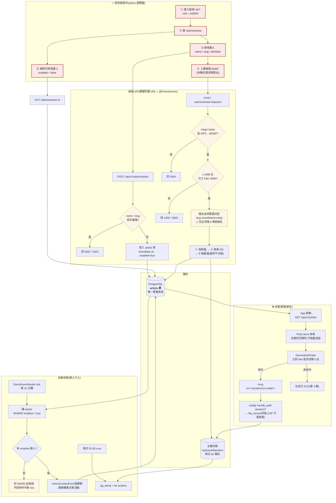

# 海報動態管理(藝人表 + 後台 CRUD + 圖片上傳)實作計畫

> ## ⚠️ 2026-08-22:啟動條件已滿足,且 schema 需要新增一個欄位
>
> 本文開頭的「**啟動時機**:等生圖路線(seeder 計畫 §6.6)實測定案後再開工」——
> **該路線已於 2026-08-22 定案**(模型產無文字底圖 + 程式合成標準字),條件解除。
>
> 兩項需要調整,詳見 §4.3 與 §5 的標註:
> - `title_style` 的形狀有答案了,且**只在 fallback 情境生效**
> - `artists` 表**需要新增 `tier` 欄位**
>
> 海報由 poster-forge 專案(`C:/Users/USER/Documents/poster-forge`,決策紀錄見其 `CLAUDE.md` §2) 產出。

> 狀態:**待 review,尚未動工**。日期:2026-08-18。
> **前置依賴**:[`2026-08-17-demo-event-seeder.md`](2026-08-17-demo-event-seeder.md) 的
> **Task 4(`DemoContentPool`)與 Task 8(`posterRegistry`)必須先完成**。
> 本計畫是那份計畫 §6.8 評估後拆出的獨立里程碑。<br/>
> 生圖操作見 [`docs/poster-generation-runbook.md`](../poster-generation-runbook.md)。
> **啟動時機**:等生圖路線(該計畫 §6.6)實測定案後再開工——路線決定了 `title_style` 欄位
> 到底要不要用,提早做會白工。

---

## 1. 目標與非目標

**目標**

- 在 admin 後台新增一個樂團(名稱 + 海報圖 + 標題樣式),**不需要改程式碼、不需要重新部署**。
- 新增的樂團**自動進入輪替桶**——seeder 下一個 tick 就會開始為它產生活動。
- 海報圖片可從後台上傳,同源提供,CSP 不需放寬。
- 消除目前「後端藝人池」與「前端 registry」兩份清單必須人工對齊的負擔。

**非目標**

- 不做圖片編輯/裁切(上傳什麼就是什麼,壓縮在本機生圖流程完成)。
- 不做多圖輪播、不做每個活動各自指定圖(那是既有 `coverImageUrl` 的職責)。
- 不做藝人的公開頁面或搜尋(這是 demo 資料管理,不是產品功能)。
- 不動 seeder 的池子架構(常駐/輪替/靜態三桶維持不變)。

---

## 2. 這個里程碑要解決的問題

seeder 計畫做完之後,狀態會是:

| 資料 | 存在哪裡 | 加一個樂團要做什麼 |
|---|---|---|
| 藝人清單(產標題用) | 後端 `DemoContentPool` 硬編碼 | 改 Java、commit、跑 CD |
| 藝人 → 海報對照 | 前端 `posterRegistry.ts` 硬編碼 | 改 TS、commit、跑 CD |
| 海報圖檔 | 打包進 frontend 映像 | 加檔案、commit、跑 CD |

三份東西、三個地方、必須同步,而且每次都要走完整的建置部署。seeder 計畫甚至為此各寫了一條
「兩邊清單要對齊」的測試——**那條測試的存在本身就是這個設計有問題的訊號**。

本里程碑把這三份合併成一份 DB 資料 + 一個主機目錄,後端與前端都從它讀。

---

## 3. 架構總覽

### 3.1 完成後的完整流程(含使用者操作介入點)

紅色節點是**人工操作**,其餘全部自動。整個設計的重點是:人只負責「決定有哪些樂團、長什麼樣」,
資料的產生與呈現完全自動。



### 3.2 使用者操作與自動流程的交界

| 使用者做什麼 | 系統自動接手什麼 | 多久生效 |
|---|---|---|
| 新增一個藝人(填名稱 + slug) | seeder 下個 tick 開始為它產生輪替桶活動 | **≤ 10 分鐘** |
| 上傳該藝人的海報 WebP | 檔案落到主機目錄,Caddy 立即可提供;訪客重整即看到 | **立即**(訪客需重整) |
| 把藝人設為 `enabled=false` | seeder 不再為它產生新活動;**既有活動與海報照常** | 下個 tick |
| 刪除藝人 | 連同圖檔刪除;既有活動退回生成式 SVG | 立即 |
| **什麼都不做** | seeder 持續維持 820 筆活動、汰換舊的、補新的 | 持續 |

**沒有任何一步需要重新部署或改程式碼**——這是本里程碑的唯一目的。

### 3.3 元件對照

| # | 元件 | 內容 |
|---|---|---|
| 1 | **圖片路由** | Caddy 加 `handle_path /posters/*` + `file_server`,volume 掛 `/opt/seckill/posters` |
| 2 | **藝人表** | Flyway `V6__create_artists.sql` |
| 3 | **後端 API** | admin CRUD + 公開唯讀清單 + 上傳端點 |
| 4 | **seeder 改讀表** | `DemoContentPool` 的藝人維度改從 `artists` 讀 |
| 5 | **前端改 fetch** | `posterRegistry` 從 `import` 常數改成啟動時抓 API(Pinia store 快取) |
| 6 | **admin 頁面** | `AdminArtistsView.vue` + router + 上傳 UI |

**關鍵性質:1 和 2~6 必須一起做才有意義。** 只做圖片路由,registry 那行仍在原始碼裡;
只做藝人表,圖仍在映像裡。任一邊沒做,「不用重新部署」就不成立。

---

## 4. 關鍵設計決策

### 4.1 圖片改由 Caddy 提供,不再打包進 frontend 映像

**決策**:圖片放主機 `/opt/seckill/posters/`,由 Caddy 直接 `file_server`。

**理由**:CSP `img-src 'self'` 要求的是**同源**,不是「必須在 frontend 映像裡」。Caddy 本來就是
唯一入口,由它提供 `/posters/*` 一樣是 `https://tixco.kozow.com` 這個 origin,CSP 完全不用動。
而圖片脫離映像之後,新增圖片不再需要重新建置與部署——這正是本里程碑的目的。

**取捨**(這些是真實損失,不是形式上的):

- **圖片不再受版控**:沒有歷史、沒有 rollback、誤刪就沒了。
  必須配套備份(見 4.5),否則主機掛掉圖全沒。
- **本機開發預設看不到圖**:dev 跑 Vite `:5173`,沒有 Caddy。解法見 4.6。
- **「目前部署了什麼」變成兩個來源**:程式碼看 git,圖片看主機目錄。

### 4.2 藝人清單升格為 DB 表:一份資料,前後端共用

**決策**:新增 `artists` 表,後端 `DemoContentPool` 讀它產標題,前端讀它對照海報。

**理由**:這是本里程碑真正的架構價值,比「後台能點按鈕」更重要。目前兩份清單分屬前後端、
必須人工對齊,seeder 計畫還為此各寫了一條檢查測試。合併之後那個同步問題**在結構上消失**,
而不是靠測試去抓。附帶效果就是使用者要的「新增藝人自動進輪替桶」。

**取捨**:seeder 從此依賴一張 admin 可改的表。若 admin 把表清空,輪替桶就沒有藝人可用
→ 必須有防呆(見 4.3 的 `enabled` 與 §10 已知限制)。

### 4.3 表設計上的三個決定

> ✅ **2026-08-22:`title_style` 的形狀有答案了,但角色改變了。**
>
> 原文說「形狀還沒定案(取決於 seeder 計畫 §6.6 生圖路線的結果),用 JSONB 可以先上線」。
> 現在路線已定:**團名由 poster-forge 離線合成、烤進 WebP**,所以正常情況下
> 前端根本不需要渲染標題。
>
> `title_style` 因此降級為 **fallback 專用**:只在「藝人有名字但還沒上傳合成好的海報」時,
> 讓前端用 CSS 疊字。形狀 = 合成器排版模板的參數:
>
> ```ts
> { fontFamily, weight, tracking, size, color, position, blend?, stroke?, shadow?, uppercase? }
> ```
>
> 見 `poster-forge/src/compose/template.ts` 的 `TitleStyle`——**那份 CSS 模板就是前端
> fallback 該用的樣式**,兩邊共用同一份實作,不要再寫第二套。
>
> **維持 JSONB 的決定不變**(理由從「形狀未定」改成「這是 fallback,不值得為它開具名欄位」)。

- **`slug` 與 `name` 分離**:`name` 是顯示與比對用的樂團名(可含中文),`slug` 是檔名與
  URL 用的小寫英數(`mayday`)。分離是因為檔名不能含中文與空白,而比對必須用原名。
- **`enabled` 旗標而非直接刪除**:停用的藝人不再產生新活動,但既有活動與海報照常運作。
  直接 DELETE 會讓已存在的活動失去海報對照(退回 SVG),而且無法復原。
- **`title_style` 用 `JSONB`**:欄位形狀還沒定案(取決於 seeder 計畫 §6.6 生圖路線的結果),
  用 JSONB 可以先上線、之後演進而不必再開 migration。**代價是失去型別檢查**,
  前端要對缺欄位有預設值。

### 4.4 檔案上傳的安全設計(本專案第一個上傳端點)

目前全站**零檔案上傳**,所以這是全新的攻擊面。設計如下,每一條都有對應的攻擊:

| 措施 | 擋掉什麼 |
|---|---|
| **檔名完全由伺服器決定**(`{slug}-{snowflakeId}.webp`),**絕不使用上傳者提供的檔名** | 路徑穿越(`../../etc/...`)、覆蓋既有檔案 |
| 落點是固定的單一目錄常數,API **不接受任何路徑參數** | 同上 |
| 只接受 **WebP**,以 **magic bytes** 判定(`RIFF....WEBP`),**不信 Content-Type、不信副檔名** | 偽裝成圖片的可執行檔或腳本 |
| 檔案大小上限 **2 MB**(`spring.servlet.multipart.max-file-size`) | 磁碟塞爆、記憶體耗盡 |
| 解析 WebP header 驗證寬高在合理範圍(如 640–4096) | 解壓縮炸彈、異常尺寸 |
| Caddy `file_server` **不開 `browse`**(預設關閉,但要明確確認) | 目錄列表洩漏 |
| 該目錄不在任何會被執行的路徑,Caddy 只做靜態提供 | 上傳後執行 |
| 端點走 `/api/v1/admin/**` + `@PreAuthorize("hasRole('ADMIN')")` 雙層 | 未授權上傳 |

**為什麼只收 WebP 而不在伺服器端轉檔**:轉檔(PNG/JPEG → WebP)需要新依賴,因為 Java 標準
`ImageIO` **不支援 WebP 寫入**,得引入 TwelveMonkeys 或 webp-imageio。依 CLAUDE.md
「新增任何第三方依賴前先說明用途與替代方案」,而這裡有零依賴的替代方案:**要求上傳前先壓好**。
使用者的生圖工作流本來就包含 ImageMagick 轉檔那一步(見 seeder 計畫 §6.3),所以這個要求
不增加任何實際負擔。**若日後真的想收 PNG/JPEG 再單獨評估依賴。**

**替換舊圖的順序**:寫新檔 → 更新 DB `image_path` → 刪舊檔。順序不可調換——若中途失敗,
寧可留下孤兒檔(無害,可清理),也不要出現 DB 指向不存在檔案的破圖狀態。

**孤兒檔清理**:提供一個 admin 端點比對 DB 與目錄,列出沒有被任何藝人引用的檔案供人工確認後刪除。
**不做自動刪除**——自動刪檔在這種對照關係上風險大於效益。

### 4.5 備份必須一併處理(容易被跳過的一項)

現況:`setup-server.sh` 安裝的每日 03:30 cron **只跑 `pg_dump`,不含任何檔案目錄**
(`infra/backup-db.sh`)。圖片一旦離開 git,就變成**完全沒有備份的資料**。

因此本里程碑**必須**擴充備份:在既有備份腳本加一段 `tar czf` 打包 `/opt/seckill/posters`,
與 DB dump 一起留在 `/opt/seckill/backups`,套用相同的保留天數。這不是加分項,是先決條件——
沒有它,這個里程碑等於把資料從「有版控」降級成「沒有任何保護」。

### 4.6 本機開發如何看到圖

**決策**:dev 把圖放 `frontend/public/posters/`(**並加進 `.gitignore`**),prod 走 Caddy 主機目錄。

兩邊的 URL 路徑都是 `/posters/{slug}.webp`,dev 由 Vite 的 `publicDir` 提供、prod 由 Caddy 提供,
**前端程式碼完全不需要區分環境**。零設定、零外掛、零依賴。

⚠️ `.gitignore` 那條**一定要記得加**,否則圖片又悄悄進了 git,本里程碑的前提就破了。

### 4.7 錯誤碼新增 5xxx 分段

設計文件第 9 節目前定義 `1xxx 認證、2xxx 活動、3xxx 搶購、4xxx 訂單`。藝人管理是新領域,
**新增 5xxx 分段**(`5001` 藝人不存在、`5002` 名稱重複、`5003` slug 重複、
`5004` 圖片格式不合法、`5005` 圖片尺寸不合法)。這是對設計文件的擴充,ADR 要記。

---

## 5. Schema(Flyway `V6__create_artists.sql`)

> ⚠️ **2026-08-22:本表需要新增 `tier` 欄位。**
>
> poster-forge 的篩選流程會把每個藝人分成兩級(A 精選 / B 備用),直接對應 seeder 的兩個桶。
> 沒有這個欄位,「人工精選的藝人才進常駐桶」這件事做不到。
>
> ```sql
> tier VARCHAR(16) NOT NULL DEFAULT 'ROTATING'
>     CHECK (tier IN ('FEATURED', 'ROTATING')),
> ```
>
> 配套的 seeder 改動(屬 seeder 計畫 Task 6 的範圍):
> - 補**常駐桶**時只取 `enabled = TRUE AND tier = 'FEATURED'`
> - 補**輪替桶**時取所有 `enabled = TRUE`
> - `FEATURED` 藝人數 < 常駐桶目標數(20)時記 WARN,**不可拋例外中斷 tick**
>
> 另可考慮加 `tour_themes JSONB`——每個藝人 2~3 個專屬巡演主題,讓 `DemoContentPool`
> 組標題時優先使用。這是使用者對活動名稱保留控制權的方式。

> Flyway 版本號承接 seeder 計畫的 V4(`events.source`)與 V5(列表索引),**本計畫從 V6 起算**。

```sql
CREATE TABLE artists (
    id           BIGINT PRIMARY KEY,                 -- Snowflake,不用自增
    name         VARCHAR(100) NOT NULL UNIQUE,       -- 顯示與比對用(可含中文)
    slug         VARCHAR(50)  NOT NULL UNIQUE,       -- 檔名/URL 用,小寫英數與連字號
    image_path   VARCHAR(200),                       -- 例 /posters/mayday-123456.webp;NULL = 尚未上傳
    title_style  JSONB,                              -- 字體/字重/字距/顏色/擺位;NULL = 用預設
    enabled      BOOLEAN      NOT NULL DEFAULT TRUE, -- FALSE = 不再產生新活動,既有不受影響
    created_at   TIMESTAMPTZ  NOT NULL,
    updated_at   TIMESTAMPTZ  NOT NULL,
    CONSTRAINT chk_artists_slug_format CHECK (slug ~ '^[a-z0-9-]+$')
);

CREATE INDEX idx_artists_enabled ON artists (enabled) WHERE enabled = TRUE;

COMMENT ON TABLE  artists           IS 'Demo 用藝人清單:seeder 產標題與前端海報對照的單一事實來源';
COMMENT ON COLUMN artists.title_style IS '前端標題樣式覆寫(JSONB,形狀依生圖路線定案)';
```

**種子資料**:表若為空,輪替桶就沒有藝人可用。因此需要一支 bootstrap
(比照 `AdminBootstrap` 的模式,`CommandLineRunner` + 冪等檢查),在表為空時寫入
seeder 計畫 `DemoContentPool` 原本硬編碼的那份藝人清單。**不用 Flyway 塞種子資料**——
那會讓 demo 資料混進 schema 版本歷史,且無法在不同環境給不同內容。

---

## 6. API 契約

| 方法 | 路徑 | 權限 | 說明 |
|---|---|---|---|
| `GET` | `/api/v1/artists` | 匿名 | 公開唯讀清單,只回 `name` / `imagePath` / `titleStyle`(**不回 id、enabled、時間戳**) |
| `GET` | `/api/v1/admin/artists` | ADMIN | 完整欄位 + 分頁 |
| `POST` | `/api/v1/admin/artists` | ADMIN | 建立(`name` / `slug` / `titleStyle`) |
| `PUT` | `/api/v1/admin/artists/{id}` | ADMIN | 更新 |
| `DELETE` | `/api/v1/admin/artists/{id}` | ADMIN | 刪除(**同時刪除其圖片檔**) |
| `POST` | `/api/v1/admin/artists/{id}/poster` | ADMIN | 上傳/替換海報(multipart) |
| `GET` | `/api/v1/admin/artists/orphan-files` | ADMIN | 列出沒有被引用的孤兒檔(**只列出,不刪**) |

- 回應一律走既有的 `ApiResponse{code, message, data}`。
- 公開端點刻意精簡欄位:前端只需要比對與渲染,不需要知道內部 id 與啟用狀態。
- 公開端點要加進 `SecurityConfig` 的匿名 GET 白名單(比照 `/api/v1/events`)。

---

## 7. 前端改動

- 新增 `stores/artists.ts`(Pinia):App 啟動時抓一次 `/api/v1/artists`,**快取在記憶體**,
  失敗時回空陣列(**不可阻塞頁面渲染**——海報只是裝飾,抓不到就全站退回 SVG 第 3 層)。
- `posterRegistry.ts` 的比對函式**保留不動**,只把資料來源從 `import` 常數換成 store。
  seeder 計畫 Task 8 已經要求資料形狀比照 API 回傳,所以這裡是**換來源不是重寫**。
- `GenerativePoster.vue` **完全不用改**——它只呼叫比對函式。
- 新增 `views/admin/AdminArtistsView.vue` + router `/admin/artists`,比照
  `AdminEventsView.vue` 的既有版式(表格 + 對話框表單 + 即時預覽)。
- 上傳 UI 用 Element Plus `el-upload`,限制 `.webp`、2 MB,上傳後即時預覽。

---

## 8. Task 拆解

每個 Task 結束就 commit(Conventional Commits + `Co-Authored-By: Claude Fable 5`)。
後端測試一律 `rtk mvn test` / `rtk mvn verify`。

### Task 1:`artists` 表與唯讀查詢

**檔案**:`V6__create_artists.sql`、`domain/Artist.java`、`mapper/ArtistMapper.java` + XML、
`ArtistMapperIT.java`

先寫失敗的 mapper 整合測試(insert / findAll / findEnabled / findByName / slug 唯一衝突),
再實作。SQL 手寫在 XML、參數一律 `#{}`、主鍵用 Snowflake `IdGenerator`。
commit:`feat(backend): artists 表與 mapper`

### Task 2:藝人 CRUD 與公開查詢

**檔案**:`ArtistService.java`、`AdminArtistController.java`、`ArtistController.java`、
DTO 群、`BizCode.java`(加 5xxx)、`SecurityConfig`(公開 GET 白名單)、`ArtistFlowIT.java`

1. 先寫失敗的整合測試:匿名可讀公開清單、非 ADMIN 打 admin 端點得 403、
   名稱/slug 重複回 5002/5003、slug 格式非法回 1400。
2. 實作 service 與兩個 controller,admin 端 URL 層 + `@PreAuthorize` 雙層防護。
3. 入參全部 Jakarta Validation。
commit:`feat(backend): 藝人管理 API(admin CRUD + 公開唯讀)`

### Task 3:種子 bootstrap

**檔案**:`ArtistBootstrap.java`、`ArtistBootstrapTest.java`

比照 `AdminBootstrap` 的 `CommandLineRunner` + 冪等模式:表為空時寫入預設藝人清單,
非空則跳過並記 log。單元測試涵蓋「已有資料 → 不寫入」。
commit:`feat(backend): 藝人清單啟動種子`

### Task 4:圖片路由與備份(基礎設施)

**檔案**:`infra/caddy/Caddyfile`、`infra/docker-compose.prod.yml`、`infra/backup-db.sh`、
`infra/setup-server.sh`、`frontend/.gitignore`

1. Caddyfile 在 `handle /api/*` 之後、catch-all 之前插入:

   ```
   handle_path /posters/* {
       root * /srv/posters
       file_server
   }
   ```

   **順序不可放到 catch-all 之後**,否則會被前端 SPA fallback 吃掉(與 `/actuator` 同一個坑)。
2. prod compose 的 caddy 服務掛 `- /opt/seckill/posters:/srv/posters:ro`(**唯讀掛載**——
   Caddy 只需要讀,寫入是 backend 的事)。
3. backend 服務掛同一目錄為**可寫**,供上傳端點寫入。
4. `setup-server.sh` 加 `mkdir -p $APP_DIR/posters` 與屬主設定。
5. `backup-db.sh` 加一段 `tar czf` 打包 posters 目錄,套用相同保留天數。
6. `frontend/.gitignore` 加 `public/posters/`。
7. 部署後實測 `curl -I https://.../posters/test.webp` 回 200 且 `Content-Type: image/webp`。
commit:`feat(infra): 海報靜態路由、儲存目錄與備份`

### Task 5:圖片上傳端點

**檔案**:`ArtistPosterService.java`、`AdminArtistController.java`、`application.yml`
(multipart 限制)、`ArtistPosterUploadIT.java`

1. 先寫失敗測試,**每一條對應 4.4 的一項防護**:
   - 非 WebP(magic bytes 不符)→ 5004
   - 超過 2 MB → 1400
   - 尺寸超出範圍 → 5005
   - 上傳的檔名含 `../` → **落點仍在固定目錄**(驗證檔名完全被忽略)
   - 非 ADMIN → 403
   - 替換舊圖 → 新檔存在、DB 已更新、舊檔已刪
2. 實作,檔名一律 `{slug}-{snowflakeId}.webp`,落點為設定常數。
3. `application.yml` 設 `spring.servlet.multipart.max-file-size: 2MB` / `max-request-size: 3MB`。
commit:`feat(backend): 海報圖片上傳(WebP、伺服器決定檔名)`

### Task 6:seeder 改讀藝人表

**檔案**:`DemoContentPool.java`、`DemoSeedMapper`、`DemoEventSeederIT.java`

1. 先寫失敗測試:新增一個 `enabled=true` 的藝人 → 下一次 `seedOnce()` 產出的活動中
   出現該藝人;設為 `enabled=false` → 不再出現在新活動(**既有活動不受影響**)。
2. `DemoContentPool` 的藝人維度改從 `artists` 表讀(只取 `enabled=true`),
   其餘維度(曲風/城市/場館/巡演主題)仍留在程式碼——那些不需要動態管理。
3. **防呆**:表中沒有任何 enabled 藝人時,seeder 記 `WARN` 並跳過建立,**不可拋例外中斷 tick**。
4. 移除 seeder 計畫 Task 4 / Task 8 那兩條「前後端清單要對齊」的測試——
   **合併之後它們已無意義**,留著會誤導。
commit:`feat(backend): seeder 藝人清單改讀 artists 表`

### Task 7:前端改 fetch 與 admin 頁面

**檔案**:`stores/artists.ts`、`posterRegistry.ts`、`views/admin/AdminArtistsView.vue`、
`router/index.ts`、`api/types.ts`、對應 spec

1. Pinia store:啟動抓一次、記憶體快取、**失敗回空陣列不阻塞渲染**。
2. `posterRegistry` 比對函式保留,資料來源換成 store。
3. `AdminArtistsView`:表格 + 新增/編輯對話框 + `el-upload`(限 `.webp` / 2 MB)+ 即時預覽。
4. router 加 `/admin/artists`,比照既有 admin 路由的守衛設定。
5. `pnpm test` / `vue-tsc` 全綠。
commit:`feat(frontend): 藝人管理後台與海報動態載入`

### Task 8:ADR 0010 與收尾

**檔案**:`docs/adr/0010-海報動態管理.md`

> ADR 編號承接 seeder 計畫的 0009,**本計畫是 0010**。

至少涵蓋:圖片改由 Caddy 提供的取捨(4.1)、藝人清單升格為單一事實來源(4.2)、
表設計三決定(4.3)、上傳安全設計逐條理由(4.4)、備份為何是先決條件(4.5)、
dev/prod 路徑一致的做法(4.6)、5xxx 錯誤碼分段擴充(4.7)、以及
**本 ADR 取代 ADR 0009 中關於「registry 前端硬編碼」的部分**(依 CLAUDE.md 的舊 ADR 不修改原則,
要在 0009 狀態行補「部分被 ADR 0010 取代」)。

跑完整 `rtk mvn verify` + `pnpm test`,push,確認 CI 綠。
commit:`docs: ADR 0010(海報動態管理)`

---

## 9. 部署與驗收

**部署順序有依賴**:Task 4 的主機目錄必須先存在,Task 5 的上傳才有落點。
若 CD 先部署了 backend 才建目錄,上傳會失敗。建議 Task 4 單獨部署一次確認無誤後,再進 Task 5。

**驗收清單**:

- [ ] `curl -I https://tixco.kozow.com/posters/{檔名}.webp` → 200 + `Content-Type: image/webp`
- [ ] `curl https://tixco.kozow.com/posters/` → **不列出目錄內容**
- [ ] 瀏覽器 console **無 CSP 違規**(img-src 未放寬仍正常顯示)
- [ ] 後台新增一個藝人 + 上傳圖 → **不重新部署**,重整前台即可看到該藝人的海報
- [ ] 該藝人在下一個 seeder tick(≤10 分鐘)後出現在輪替桶的新活動裡
- [ ] 把該藝人設為 `enabled=false` → 不再產生新活動,**既有活動的海報仍正常**
- [ ] 上傳一個改名為 `.webp` 的 PNG → 回 5004 被拒
- [ ] 上傳檔名為 `../../evil.webp` → 檔案落在固定目錄、名稱為 `{slug}-{id}.webp`
- [ ] 隔日確認 `/opt/seckill/backups` 有 posters 的 tar 檔
- [ ] 本機 dev 把圖放 `frontend/public/posters/` → Vite 也看得到,且 `git status` **不顯示那些圖**

---

## 10. 已知限制

- **藝人表為空 = 輪替桶停止產生新活動**。有 bootstrap 種子與 WARN 防呆,但 admin 若手動把所有
  藝人停用,seeder 會安靜地什麼都不做(只有 log)。這是刻意的——不該讓 demo 資料產生器強制
  覆寫管理員的決定。
- **圖片沒有版控與 rollback**。備份是每日一次的 tar,粒度就是一天;當天上傳後誤刪,救不回來。
- **`title_style` 是 JSONB,沒有型別檢查**。欄位打錯不會在後端被擋下,前端必須對缺欄位有預設值。
- **公開藝人清單是全量回傳**,沒有分頁。40~100 個藝人沒問題,若日後暴增需改成分頁或加快取 header。
- **孤兒檔只列出不自動刪**。長期會累積,需要人工定期清。
- **前端 store 只在啟動時抓一次**。後台改完藝人後,已開著的分頁要重整才會看到——demo 場景可接受。
- **dev 與 prod 的圖片內容可能不同步**(一邊在 repo 外的本機目錄、一邊在主機)。這是脫離版控的
  必然後果,不是 bug。

---

## 11. 待決事項

> ✅ **2026-08-22:待決 #2(`title_style` 用 JSONB 還是具名欄位)已結案 → 維持 JSONB**,
> 理由見 §4.3 標註(角色已改為 fallback 專用)。

| # | 問題 | 我的建議 |
|---|---|---|
| 1 | 只收 WebP(要求上傳前自己壓)還是收 PNG/JPEG 由伺服器轉檔? | **只收 WebP**。轉檔要新依賴(Java `ImageIO` 不支援寫 WebP),而生圖流程本來就有 ImageMagick 那一步 |
| 2 | `title_style` 用 JSONB 還是拆成具名欄位? | **先 JSONB**。形狀取決於生圖路線(seeder 計畫 §6.6)還沒定案;定案後若穩定,再開 migration 拆欄位 |
| 3 | 刪除藝人時是否連同其既有活動一起刪? | **不要**。只刪藝人與圖檔,既有活動退回 SVG 海報。連動刪活動的破壞力太大且不可逆 |
| 4 | 公開端點 `/api/v1/artists` 要不要加快取 header? | 可以加 `Cache-Control: max-age=300`;但後台改完要等 5 分鐘才生效,**demo 時容易讓你以為沒存到**。建議先不加 |
| 5 | 要不要順便把 `venue` / 曲風也做成可管理? | **不要**。那些不需要對應圖片,硬編碼即可,擴大範圍只會拖長里程碑 |

---

## 12. 風險與回復路徑

| 風險 | 防護 | 回復方式 |
|---|---|---|
| 圖片目錄遺失(主機重建、誤刪) | 每日 tar 備份(Task 4) | 從 `/opt/seckill/backups` 解壓;最差情況是重跑本機生圖流程 |
| 上傳端點被濫用 | ADMIN 雙層防護 + 2 MB 上限 + magic bytes + 伺服器決定檔名 | 停用端點(移除 controller 方法重新部署);目錄可直接檢視異常檔案 |
| Caddy 路由順序寫錯導致 `/posters/*` 落到 SPA fallback | 部署後 `curl -I` 驗 Content-Type | 改 Caddyfile 重新部署;與 `/actuator` 是同一個已知坑 |
| seeder 因藝人表空掉而停擺 | bootstrap 種子 + WARN 日誌 | 後台重新啟用任一藝人,下個 tick 即恢復 |
| JSONB 欄位形狀混亂 | 前端對缺欄位有預設值 | 直接 `UPDATE artists SET title_style = NULL`,退回預設樣式 |
| migration 影響既有資料 | 純新增資料表,**不動任何既有表** | Flyway 失敗會擋住 backend 啟動,舊容器仍在;必要時 rollback 映像 tag |
